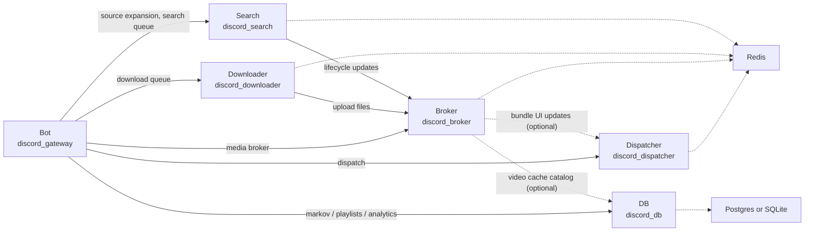

# Architecture

Describes how the bot runs in multi-pod mode, how the components communicate,
and what each pod is responsible for.

---

## HA is the only mode

There is no single-process mode any more — it was retired by the
discord-bot-ha-only project. Cog logic (music, markov, etc.) runs in the bot
(gateway) pod; Discord API calls are handled exclusively by a dedicated
dispatcher pod, reached over HTTP via `HttpDispatchClient`
(`discord_core/clients/http_dispatch_client.py`), injected into every cog
via `CogHelperBase.__init__`. There is no `CogHelper._dispatcher` property
and no in-process fallback: `discord_gateway/cli/bot.py::run()` raises
`DiscordBotException` at startup if `general.dispatch_http_url` is missing.

The bot pod separately requires `general.database_http_url`, pointing at the
`discord-db` pod — equally hard-required, equally no fallback (see
[Database](./configuration.md#database)).

---

## Components

Verified against each pod's own `Http*Client` construction, not reconstructed
from prose — see the per-pod notes below the diagram for what backs each
arrow.



Every solid arrow is an unconditional `Http*Client` the source pod always
constructs when the relevant cog/feature is enabled; every dashed arrow is
config-gated and silently skipped (with a warning) if the required URL is
missing:

- **Bot → Dispatcher** (`HttpDispatchClient`): hard-required — `bot.py::run()`
  raises at startup if `dispatch_http_url` is missing.
- **Bot → Broker / Search / Downloader** (`HttpBrokerClient`,
  `HttpMediaSearchClient` + `HttpYoutubeMusicSearchClient`,
  `HttpDownloadClient`): constructed by the music cog only.
- **Bot → DB** (`HttpPlaylistStore` / `HttpMarkovStore` /
  `HttpGuildAnalyticsStore`, all `HttpStoreBase` subclasses built by
  `build_http_stores()`): one store per db-backed cog.
- **Downloader → Broker**, **Search → Broker** (`HttpBrokerClient`):
  unconditional in both pods' `run()`.
- **Broker → Dispatcher** (`HttpDispatchClient`): only if
  `general.dispatch_http_url` is set; otherwise the broker tracks bundle
  state but never pushes a Discord message update.
- **Broker → DB** (`HttpVideoCacheStore`): only if
  `music.download.cache.enable_cache_files`, `general.database_http_url`,
  and `music.storage.bucket_name` are all set; otherwise the video cache is
  disabled for that broker instance.
- **Dispatcher, Broker, Downloader, Search → Redis**: each holds its own
  `RedisManager`; the bot and the db pod do not connect to Redis at all
  (the bot's `redis_manager` constructor param exists but is never wired to
  a real URL in `bot.py::run()`).
- **DB → Postgres or SQLite**: the only pod with a database engine; every other pod's
  `[database]` extra was removed along with its SQLAlchemy/asyncpg imports.

This is the only pod-to-pod picture — it's hand-drawn, but every edge on it
was checked against the code above, and it adds Redis, the database and the
solid/dashed unconditional-vs-config-gated distinction that a measurement
can't see. The measured detail behind it — exact route counts per edge,
straight from the `SEAM`/`ROUTES_CALLED` registries, so it cannot drift, not
a second diagram, a table — follows below, and it was cross-checked against
this diagram while writing it: the two agree on every edge.

### Which pod calls which

<!-- BEGIN GENERATED(seam-topology) by tests/cli/test_seam_topology.py. Do not edit this block by hand.
     Regenerate with: UPDATE_SEAM_TOPOLOGY=1 pytest tests/cli/test_seam_topology.py -->

The pod-to-pod HTTP topology, derived from the `SEAM` / `ROUTES_CALLED`
declarations the runtime route check already reads and from the registry each
server module imports. Measured by importing each image entrypoint in a clean
interpreter. Nothing here is hand-maintained and there is no prefix-to-pod map
written down anywhere, so it cannot drift from the registries.

A client class being reachable by import (what this measures) is not the same
as the call actually firing under some config, so an edge listed here as
unconditional may still be config-gated in practice at runtime — cross-check
the diagram above's solid/dashed distinction for that. What this adds beyond
the diagram is the exact route count behind each edge, broken out by prefix
where one seam is served by more than one pod.

**A seam is a route shape, not a pod.** Four of the five are served by exactly
one pod, but `queue_worker` is an abstract base subclassed twice -- at
`/downloads` on the downloader and `/search/ytmusic` on the search pod -- so
`discord-gateway` has two separate dependencies there, not one. The search pod also
answers two different seams, `media_search` and `queue_worker`, behind one
composite app.

#### Edges

| caller | peer | seam | prefix | client | routes |
|---|---|---|---|---|---|
| `discord-broker` | `discord-db` | database | `/database/video_cache` | `HttpVideoCacheStore` | 6 |
| `discord-broker` | `discord-dispatcher` | dispatch | — | `HttpDispatchClient` | 8 |
| `discord-downloader` | `discord-broker` | broker | — | `HttpBrokerClient` | 22 |
| `discord-gateway` | `discord-broker` | broker | — | `HttpBrokerClient` | 22 |
| `discord-gateway` | `discord-db` | database | `/database/guild_analytics` | `HttpGuildAnalyticsStore` | 2 |
| `discord-gateway` | `discord-db` | database | `/database/markov` | `HttpMarkovStore` | 9 |
| `discord-gateway` | `discord-db` | database | `/database/playlist` | `HttpPlaylistStore` | 16 |
| `discord-gateway` | `discord-dispatcher` | dispatch | — | `HttpDispatchClient` | 8 |
| `discord-gateway` | `discord-search` | media_search | — | `HttpMediaSearchClient` | 2 |
| `discord-gateway` | `discord-downloader` | queue_worker | `/downloads` | `HttpDownloadClient` | 4 |
| `discord-gateway` | `discord-search` | queue_worker | `/search/ytmusic` | `HttpYoutubeMusicSearchClient` | 4 |
| `discord-search` | `discord-broker` | broker | — | `HttpBrokerClient` | 22 |

#### Seams

| seam | served by | called by | routes |
|---|---|---|---|
| broker | `discord-broker` | `discord-downloader`, `discord-gateway`, `discord-search` | 22 |
| database | `discord-db` | `discord-broker`, `discord-gateway` | 33 |
| dispatch | `discord-dispatcher` | `discord-broker`, `discord-gateway` | 8 |
| media_search | `discord-search` | `discord-gateway` | 2 |
| queue_worker | `discord-downloader`, `discord-search` | `discord-gateway` | 8 |

#### Images that call no seam

`discord-db`, `discord-dispatcher`.

Serve-only pods. An image appearing here that should be calling something is the failure this doc makes visible.

<!-- END GENERATED(seam-topology) -->

---

## Request flow

### Fire-and-forget (send, delete, mutable updates)

1. Cog calls e.g. `self.dispatch_message(guild_id, channel_id, 'text')`.
2. `self.dispatcher` (injected as an `HttpDispatchClient`) creates an async task
   that POSTs `{"guild_id": ..., "channel_id": ..., "content": ...}` to
   `POST /dispatch/send` on the dispatcher pod.
3. `DispatchHttpServer` extracts W3C traceparent from headers, enqueues the
   payload to the Redis sorted set, and returns 202.
4. A Redis worker (`_redis_worker`) on the dispatcher pod pops the item via
   `BZPOPMIN`, routes by member prefix, and calls the appropriate
   `MessageDispatcher` method, which issues the Discord API call with retry.

The cog does not wait for the Discord call to complete.

### Awaitable fetches (channel history, guild emojis)

1. A cog submits a `FetchChannelHistoryRequest` via `submit_request`.
2. `HttpDispatchClient` POSTs to `POST /dispatch/fetch_history`.
3. The server computes a stable `request_id` (SHA-256 of params), enqueues the
   fetch, and returns `{"request_id": "<hex>"}` with 202.
4. `HttpDispatchClient._poll_result()` polls
   `GET /dispatch/results/{request_id}` with exponential backoff
   (0.5 s base, 10 s max, 300 s timeout).
5. A Redis worker executes the history fetch, stores the result in Redis
   under `discord_bot:dispatch:result:{request_id}` (TTL 1 day), and the next
   poll returns 200 with the result body.
6. `HttpDispatchClient` decodes the result and delivers it to the cog's result
   queue (registered via `register_cog_queue`).

### Mutable bundle deduplication across pods

Mutable bundles (e.g. the music queue display) must not be updated concurrently
by two workers on different pods. The dispatcher uses a per-bundle Redis lock:

```
acquire SET NX discord_bot:dispatch:executing:{bundle_key}  (TTL 30 s)
    ↓ acquired
execute bundle flush
    ↓
release DEL discord_bot:dispatch:executing:{bundle_key}
```

If the lock is already held, the worker re-enqueues the sentinel at HIGH
priority and moves on. The lock TTL of 30 s is a safety net — if a pod dies
mid-execution, the lock expires and another pod can proceed within 30 s.

Bundle state is persisted to Redis (`discord_bot:bundle:{bundle_key}`, TTL 1 day)
after each flush, and loaded back on dispatcher startup so mutable messages
survive pod restarts.

---

## Redis key reference

The dispatcher's Redis key patterns and priority scoring are documented once,
in [Redis keys used by the dispatcher](message_dispatcher.md#redis-keys-used-by-the-dispatcher)
and [Priority levels](message_dispatcher.md#priority-levels) — not repeated
here.

---

## Configuration reference

### Dispatcher pod

The dispatcher pod's own config fields and a full `discord.dispatcher.cnf`
example are in [message_dispatcher.md's Configuration
section](message_dispatcher.md#configuration) — not repeated here.

### Redis connection: direct URL vs. Sentinel

`redis_url` connects to a single fixed endpoint — fine for local/dev, or a
single-primary deployment. In production Redis runs as Valkey + Sentinel (three
nodes, one primary), where the primary role floats across pods on failover. Set
`redis_sentinel` instead so the client discovers the current primary via
Sentinel on every connection — a promotion is then transparent to the app:

```yaml
general:
  # redis_sentinel takes precedence over redis_url when both are set.
  redis_sentinel:
    sentinels:
      - "redis-sentinel:26379"     # the redis-sentinel Service (one entry is enough; more sentinels are auto-discovered)
    service_name: "mymaster"       # the monitored primary's name (Sentinel's `mymaster`)
```

The same `redis_sentinel` block applies to the dispatcher, the broker, and any
process that opens Redis.

### Bot / cog pod

```yaml
general:
  discord_token: "YOUR_TOKEN"      # gateway connection
  dispatch_http_url: "http://dispatcher:8082"   # all dispatch calls go here
  database_http_url: "http://db:8085"           # all database calls go here
  include:
    default: true
    markov: true
    delete_messages: true
    music: true
```

`dispatch_http_url` activates `HttpDispatchClient`, and `discord_gateway/cli/bot.py`
refuses to start without it — equally for `database_http_url`, which activates
this pod's HTTP store clients to `discord-db`. There is no longer an
in-process fallback to fall back *to*: the single-process entrypoint that
built a local `MessageDispatcher` was retired, and the bot's own database
engine went with the same migration, so either URL being unset is a startup
error rather than a quiet mode switch. `message_dispatcher` is not a valid
`include` key on this pod — `MessageDispatcher` is the separate dispatcher
pod's own worker, not one of `POSSIBLE_COGS`.

---

## Observability

Trace propagation, the dispatcher's span reference, and its metrics all live
in the dedicated monitoring docs now: see [Dispatcher trace
propagation](monitoring/trace_linking.md#dispatcher-trace-propagation) for
how context crosses the HTTP+Redis hop and the full span table, and
[Metrics Reference](monitoring/metrics_reference.md#messagedispatcher-metrics)
for `dispatcher_ready_check`, `message_dispatcher_queue_depth` (**planned,
not currently emitted** — do not treat it as a real series), and the
`heartbeat{background_job="message_dispatcher"}` loop-health gauge.

---

## Docker Compose

`docker/docker-compose.multiprocess.yml` starts the full split. The downloader
comes in two flavours behind two **mutually exclusive profiles** — pick one; the
core services have no profile and always start:

| Service | Profile | Image | Purpose |
|---------|---------|-------|---------|
| `redis` | — | `redis:7-alpine` | Shared state; persisted via named volume |
| `postgres` | — | `postgres:16-alpine` | Bare postgres — **no `discord-db` service sits on top of it** (see caveat below) |
| `dispatcher` | — | `Dockerfile.dispatcher` | HTTP server + Redis worker; makes outbound Discord REST calls on the bot's behalf |
| `broker` | — | `Dockerfile.broker` | S3 media checkout/release; persists and serves download/search results to the bot |
| `search` | — | `Dockerfile.search` | Standalone search tier; resolutions return via the broker |
| `bot` | — | `Dockerfile.gateway` | Holds the actual Discord gateway connection; cog logic; enqueues to the downloader + reads results from the broker |
| `downloader-direct` | `local` | `Dockerfile.downloader` | Download worker with no tunnel — default egress, **no Mullvad key** |
| `gluetun` | `vpn` | `qmcgaw/gluetun` | One Mullvad WireGuard tunnel; `downloader-vpn` shares its netns |
| `downloader-vpn` | `vpn` | `Dockerfile.downloader` | Download worker, in-tunnel, per-download SOCKS5 exits (prod shape) |

**This compose file has no `db` service.** `discord-db` (`Dockerfile.db`, port
8085) is a real, separate pod in production, but nothing in
`docker/docker-compose.multiprocess.yml` builds or runs it — the `postgres`
service above is bare postgres with no HTTP API in front of it. Since
`discord_gateway/cli/bot.py::run()` hard-requires `general.database_http_url`,
the `bot` service as checked in cannot actually reach a database through this
compose file. Treat the compose file's database wiring as incomplete rather
than a working reference until a `db` service is added.

**Contributor default — no Mullvad account needed:**

```bash
cp docker/.env.example docker/.env      # Discord + music creds; leave MULLVAD_* blank
docker compose -f docker/docker-compose.multiprocess.yml --profile local up -d --build
```

**Prod shape, with per-download Mullvad exits:**

```bash
cp docker/.env.example docker/.env      # ...plus a real MULLVAD_WG_PRIVATE_KEY
docker compose -f docker/docker-compose.multiprocess.yml --profile vpn up -d --build
```

gluetun never reports healthy without a real Mullvad key and the downloader is
gated on `service_healthy`, which is why the pair sits behind a profile: without
it, a contributor with no key cannot bring the stack up at all.

Both flavours answer to the network alias **`downloader-host`**, so
`discord.bot.cnf` points at `http://downloader-host:8083` either way (for the
tunnel flavour the alias lives on `gluetun`, since `downloader-vpn` shares its
netns and has no network identity of its own). Nothing in the bot config changes
when you switch profiles.

Config files go in `volumes/cnf/` (copy the `docker/*.cnf.example` files):
`discord.dispatcher.cnf`, `discord.broker.cnf`, `discord.search.cnf`,
`discord.bot.cnf`, and the downloader config for your profile —
`discord.downloader.direct.cnf` for `local`, `discord.downloader.cnf` (which
carries the `mullvad-socks5` egress block, see
[Egress Modes](./music.md#egress-modes)) for `vpn`. Each is mounted at
`/opt/discord/cnf/discord.cnf` in its container.

### Startup order

There is no single linear order — each service's `depends_on` only names
what it actually needs, and compose only serializes along those edges:

| Service | Waits on | Condition |
|---|---|---|
| `redis`, `postgres` | — | (no dependencies) |
| `dispatcher` | `redis` | started |
| `broker` | `redis`, `postgres` | started, healthy |
| `downloader-direct` (`local`), `search` | `redis`, `broker` | started, started |
| `downloader-vpn` (`vpn`) | `gluetun`, `redis`, `broker` | healthy, started, started |
| `bot` | `redis`, `dispatcher`, `postgres`, `search` | started, healthy, healthy, started |

Two things worth calling out, since the pod diagram above could suggest
otherwise:

**`dispatcher` has no `depends_on` entry for `broker`, `downloader`, or
`search` at all** — it only waits on `redis`, so compose is free to start it
in parallel with `broker` rather than strictly after it.

**`bot` waits on `search`, but not on `broker` or either downloader
flavour**, even though the bot pod is an `HttpBrokerClient` and
`HttpDownloadClient` of both (see [Components](#components)). The
downloader is skipped because compose can't make a profile-less service
depend on a profiled one — see the comment above `bot`'s `depends_on` block,
which also notes the bot's downloader-status poller tolerates the
downloader being absent, late, or mid-restart. The broker has no such
comment, but the mechanism is the same at the call level: every
`Http*Client`, including `HttpBrokerClient`, routes its outbound calls
through `HttpClientMixin._call()`, which retries via
`async_retry_broker_command()` — up to 3 attempts with exponential backoff
on a connection failure — so a `!play` command issued before the broker is
ready fails and retries on that one call rather than blocking bot startup.
`dispatcher` is the one pod bot *does* hard-gate on
(`condition: service_healthy`), even though `HttpDispatchClient` layers its
own circuit breaker on top of the same retry primitive; the compose file
doesn't say why dispatcher gets a startup gate and broker/search don't, so
treat that as a real asymmetry rather than an oversight until confirmed
otherwise.

### Testing SOCKS5 egress

`downloader-vpn` runs `network_mode: service:gluetun`, so it egresses each download
through a different Mullvad exit's SOCKS5 over the one tunnel. gluetun keeps the
compose network off the tunnel (`FIREWALL_OUTBOUND_SUBNETS` + `DOT: off` /
`DNS_ADDRESS: 127.0.0.11`) so redis/broker stay reachable. Play a track, then watch
which exit each download left from:

```bash
docker compose -f docker/docker-compose.multiprocess.yml logs -f downloader-vpn | grep "egress via exit"
```

> **Note:** neither downloader config has an S3 bucket configured, so finished files stay local
> and won't play back (the bot can't read the downloader's disk). That's enough to
> validate egress; for real end-to-end playback add a MinIO service and a bucket to
> the downloader/broker/bot configs.

## Container runtime details

### Non-root user and volume permissions

Every image runs as a non-root `discord` user (UID/GID 1000). The entrypoint
script (`docker-entrypoint.sh`) creates its own subdirectories under
`/opt/discord` (`/opt/discord/cnf`, `/opt/discord/downloads`) if they don't
already exist, checks that mounted volumes are writable, and warns if they
aren't — so an empty host directory works, but it (and `/var/log/discord`)
must be owned by UID/GID 1000 on the host (`chown -R 1000:1000`), or the
container must be run with `--user $(id -u):$(id -g)`, which can itself
mismatch permissions baked into the image. See [Config File
Location](./configuration.md#config-file-location) for where each pod
expects its config mounted.

### Health checks

Every image ships a `HEALTHCHECK`, but only the bot's actually exercises the
health server's `/health` endpoint — the other five probe a raw TCP
connection to the pod's own application port instead. See [Health server
documentation](./monitoring/health_server.md#docker-integration) for the
full breakdown and [Health Check](./configuration.md#health-check) for the
config toggle.

### Debug builds

`docker/Dockerfile.gateway` accepts an `INSTALL_HEAPTRACK` build arg
(default `false`) for memory-profiling sessions:

```bash
docker build --build-arg INSTALL_HEAPTRACK=true -f docker/Dockerfile.gateway -t discord-gateway:debug .
```

The production image excludes it to keep image size down; keep debug images
local — there's no need to push them to the registry.

### No database driver in the bot image

The bot image (`docker/Dockerfile.gateway`) carries no database driver
(PostgreSQL or SQLite) — SQLAlchemy, asyncpg and aiosqlite are not among
`discord_core`'s or `discord_gateway`'s dependencies, since the bot talks to the database exclusively over HTTP (see
[Database](./configuration.md#database)). The driver is installed only in
the `discord-db` image (`docker/Dockerfile.db`), the sole image that opens a
real database connection and runs the alembic migrations.
