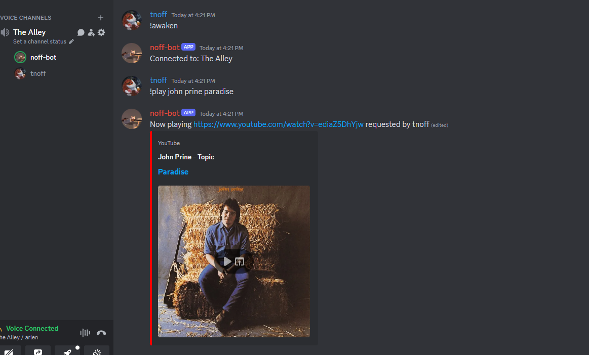
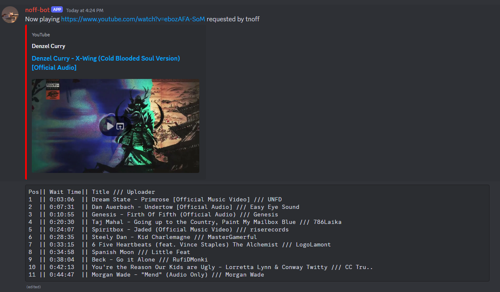
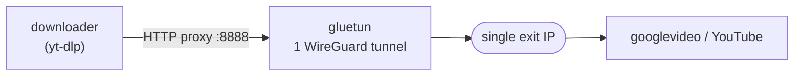
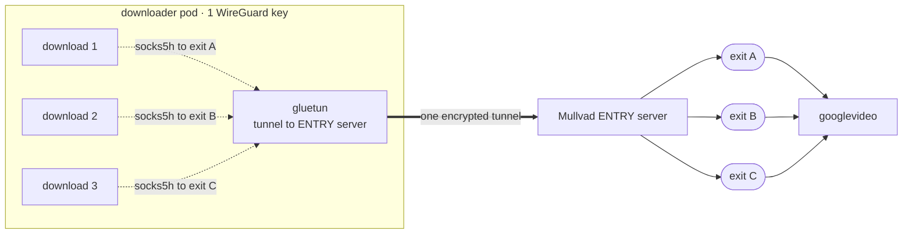
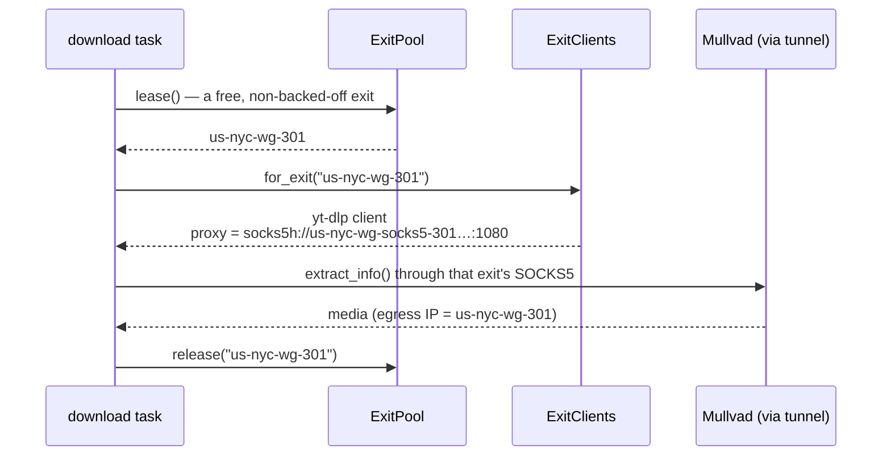

# Music Cog

Play audio from internet videos in voice chat. The bot can be called to join voice chat, and videos can be requested to be downloaded, processed, and played in the voice chat. Video audio will play one at a time and can be added to a queue to be played after the current video audio is played or skipped.

The bot is designed to be able to run on multiple servers at the same time.

## Inputs

Potential input includes
- A string that will be searched in Youtube Music and download the first result
- A direct Youtube link that will be downloaded
- A Spotify playlist or album (if Spotify credentials are given in the config)
- A Youtube playlist (if Youtube credentials are given in the config)

## Basic Usage

Once joined to a voice chat channel, call `!join` or `!awaken` to have the bot join the same voice channel you are in. Then enter `!play` with the input of the video you would like to listen to.



If multiple videos are requested, they will be downloaded and placed into the queue, which will be posted to the channel.



There is some logic to ensure that the queue messages are the most recent messages shown in the channel, for readability.

## Basic Functions

Other basic functions of music playing include

Skipping a video

```
!skip
```

Remove video from the queue
```
!remove <queue-position>
```

Bump video to the top of the queue

```
!bump <queue-position>
```

Stop the bot from playing audio and delete the queue

```
!stop
```

Show history of videos played by the bot during its current session

```
!history
```


If you would like to move the queue messages to a different channel, call `!move-messages` from the channel you'd like to move the messages to.

## Playlist Functions

If database creds are given to the bot, playlists can be created and updated to the server. This will allow you to save lists of videos to be played within the server. By default, a "history" playlist is created which adds previously played videos from the server. Anyone can queue these videos up in the server using:

```
!playlist queue 0
```

To list the current playlists

```
!playlist list
```

To create a custom playlist use:

```
!playlist create <name>
```

To add a specific video to a playlist:

```
!playlist item-add <playlist id> <video input>
```

To show the videos saved to a playlist

```
!playlist show
```

To queue up all vidoes in a playlist

```
!playlist queue <playlist id>
```

These can also be shuffled

```
!playlist queue <playlist id> shuffle
```


### Advance Playlist Features


To save all videos currently in the queue to a playlist

```
!playlist save-queue <playlist name>
```

To save all videos currently in the history to a playlist

```
!playlist save-history <playlist name>
```

To merge two playlists

```
!playlist merge <playlist one id> <playlist two id>
```

Remove an item from a playlist

```
!playlist item-remove <playlist id> <item id>
```

## Spotify Enablement

You can pass [Spotify API](https://developer.spotify.com/) credentials to the config to allow for Spotify playlists and albums to be given as input. This will request the track information from Spotify, then the bot will run a search for "`<artist name>` `<song name>`", and download the first result.

You can pass the Spotify credentials into the config:

```
music:
  download:
    spotify_credentials:
      client_id: secret-spotify-client
      client_secret: secret-spotify-client-secret
```

## Youtube Playlist Enablement

You can pass [Youtube API Key](https://developers.google.com/Youtube/v3/getting-started) credentials to the config to allow for Youtube playlists to be given as input. This will request all of the video Ids in the playlist and download all of them to the queue.

You can pass Youtube API credentials into the config:

```
music:
  download:
    youtube_api_key: secret-youtube-api-key
```

## Multi Video Input Shuffles

Note that with either Spotify playlists/albums or Youtube playlist input, you can pass `shuffle` to the play input to have the videos shuffled.

```
!play <spotify-playlist-link/youtube-playlist-link> shuffle
```

## Under the Hood

`ffmpeg` must be installed on the bot host. It is used during audio processing after download.

All videos are downloaded by the bot via [yt-dlp](https://github.com/yt-dlp/yt-dlp). The video audio is then left on disk and deleted after the video is played. You can specify what directory the videos are downloaded to in the config:

```
music:
  download:
    download_dir_path: /tmp/discord
```

Specifically when videos are downloaded, they go to the base directory of the download dir. A subdirectory is then created matching the server id, and a symlink is created between the video file and the server subdirectory, with the symlink endpoint given a random UUID. When a video is deleted, the symlink is deleted, and when the bot has not actively being used in any server, the download directory is cleared.

This is to ensure:
- A video can be played within a queue multiple times, and deleting it when the first iteration is over does not delete all files for the same video
- If the same video is downloaded by multiple servers, there is not contention over which player uses which file

### Audio Processing

After download, each file is converted to raw PCM (16-bit little-endian stereo 48 kHz). The converted `.pcm` file replaces the original download before playback begins.

#### Audio quality

Audio is already pulled at maximum quality and there is nothing to tune for it. The download uses yt-dlp's `format: bestaudio/best` selector, which fetches the single highest-quality audio stream available, and that stream is then converted straight to lossless raw PCM (above) for playback. No lossy re-encode happens anywhere in this path.

Note that yt-dlp's `--audio-quality` flag (its `FFmpegExtractAudio` postprocessor `preferredquality`) does **not** apply here and is intentionally not set. That flag only controls the VBR quality of a *lossy* re-encode performed when yt-dlp extracts audio to a compressed codec (mp3, etc.) via `-x`. Because the bot keeps the best source stream untouched and converts to uncompressed PCM itself, adding an `FFmpegExtractAudio` postprocessor via [`extra_ytdlp_options`](#extra-yt-dlp-options) would insert a lossy transcode *before* the PCM step — lowering quality and adding CPU, not improving anything. Leave it unset to keep audio at its best.

Audio normalization (EBU R128 loudness via ffmpeg's `loudnorm` filter) is available but disabled by default due to processing time. Enable it with:

```yaml
music:
  download:
    normalize_audio: true
```

Playback uses `discord.PCMAudio`, which reads the pre-converted file directly with no subprocess. The alternative, `discord.FFmpegPCMAudio`, keeps an FFmpeg subprocess alive for the entire duration of playback — one per active player. Converting ahead of time on the download side eliminates that per-player FFmpeg overhead entirely.

The tradeoff is disk space: raw PCM is roughly 11 MB/min versus ~1 MB/min for a compressed format. For short-lived playback files this is acceptable, but worth keeping in mind if cache retention is long.

The converted PCM files are written to a per-guild subdirectory under the player working directory. By default this is a temporary directory that is cleaned up automatically on shutdown. If you are running on a host with a dedicated volume for bot storage (e.g. a Docker volume or separate disk mount), you can pin it to a specific path:

```
music:
  player:
    player_dir_path: /data/discord-bot/players
```

When `player_dir_path` is set, the directory is created on startup if it does not exist. On shutdown, per-guild subdirectories are still removed as players disconnect, but the root directory itself is left in place so it survives restarts.

Do to disk limitation you may wish to limit the queue size, max length of a video that can be played, max playlist size that can be used.

```
music:
  player:
    queue_max_size: 256
  playlist:
    server_playlist_max: 64
  download:
    max_song_length: 3600 # In seconds
```


### Caching

You can enable caching so that videos are not deleted automatically when all players are stopped on the server. The bot then has logic to use the previous download when the same video is then downloaded again. There can be a max cache number given that limits the number of videos downloaded at a time, which older/less played videos will be deleted.

Caching requires `storage` to be configured (see [Backup Storage](#backup-storage) below). `enable_cache_files: true` without a `storage` block is a configuration error.

```
music:
  download:
    cache:
      enable_cache_files: true
    storage:
      bucket_name: my-music-bucket
```

The videos downloaded will be stored in a `VideoCache` table within the database. The database will also store the relevant video metadata (such as title and duration) used by the bot later. The video is identified by the full URL of the download, and should be used with all extractors.

You can configure how many cached videos are stored on disk, with the video last used (sometimes called "iterated") being deleted first.

```
music:
  download:
    cache:
      max_cache_files: 2048
```

You can also set a total disk size budget (in megabytes). When the cache exceeds this size, the oldest entries are evicted first until the total is within budget.

```
music:
  download:
    cache:
      max_cache_size_mb: 10240
```

Both limits can be used together; each evicts independently and the effects compose.

Here is a diagram of how the layers of caching interact with each other:


### Extra YT-DLP Options

You can pass in extra options for the [yt-dlp](https://github.com/yt-dlp/yt-dlp/) client. These should be inputted as a dictionary/hash and will be passed in to the YTDLP client when the download client is created.

```
music:
  download:
    extra_ytdlp_options:
      proxy: http://localhost:8888
```

### Egress Exit Attribution

When downloads egress through a VPN/proxy (see [Extra YT-DLP Options](#extra-yt-dlp-options)), a flagged or throttled exit IP looks the same as any other download failure. Enabling an **egress probe** attributes each download to the exit it actually left from, so a bad exit is identifiable and can be pruned.

`egress_probe` selects a probe by name. It is **off by default** — when unset, exit attribution reads `unknown` and nothing extra is polled. When set, the probe polls an IP-reporting endpoint **through the same proxy** yt-dlp uses (on a slow interval, so it never adds meaningful load) and caches the live exit. Supported values:

| Value | Provider | Endpoint |
| --- | --- | --- |
| `mullvad` | Mullvad VPN | `am.i.mullvad.net/json` |

```
music:
  download:
    egress_probe: mullvad
    extra_ytdlp_options:
      proxy: http://localhost:8888
```

When enabled, the live exit is attached to observability — deliberately **not** as a high-cardinality metric label:

- the `music.download_client.create_source` span gets `egress.hostname` / `egress.ip` attributes
- each YouTube download failure logs `Download failure (<type>) attributed to egress exit <hostname>`

Aggregate failure alerting stays on the existing `download_failure_count` metric; the per-exit breakdown is a trace/log drill-down. The probe runs in the standalone [HA downloader](ha.md) process, which owns the proxy. An unknown `egress_probe` value fails at startup rather than silently disabling attribution. Add a new provider by subclassing `ExitProbe` in `discord_bot/utils/integrations/egress_probe.py` and registering it in `EXIT_PROBE_TYPES`.

### Egress Modes

> ℹ️ **`mullvad-socks5` is complete, behind a flag, and gated on a deployment step.** `egress_mode` defaults to `http-proxy` (the model everything above describes) — no behavior change until a config opts in. The pool mode is fully implemented and validated: per-download exit selection, per-exit backoff + attribution, N-task concurrency, and per-request scratch isolation. Enabling it in **prod** additionally requires the downloader pod to run gluetun as an in-pod sidecar, so it sits inside the tunnel to reach the SOCKS5 exits — until that cutover lands, keep `http-proxy` in prod. Tracked in the exit-server attribution project.

`music.download.egress_mode` selects how a download leaves the network:

| Value | Behavior |
| --- | --- |
| `http-proxy` (default) | Every download goes through one fixed HTTP proxy — a **single shared** VPN exit IP. One flagged exit fails everything until it's manually rotated. |
| `mullvad-socks5` | Each download leaves through a **different** Mullvad exit, chosen per-download via that server's SOCKS5 proxy. A flagged exit only affects the downloads on it and is dropped from rotation in-app. |

`music.download.egress_exits` is the list of Mullvad WireGuard server names a pool mode rotates through (unused by `http-proxy`). An empty list, or an unknown `egress_mode`, fails loudly at startup.

```yaml
music:
  download:
    egress_mode: mullvad-socks5
    egress_exits:
      - us-lax-wg-001
      - us-nyc-wg-301
      - us-sea-wg-001
```

#### `http-proxy` — one shared exit (today)

All yt-dlp traffic goes through a single gluetun HTTP proxy, so every download shares one exit IP. When YouTube flags that IP, *all* downloads fail until the exit is rotated.


```mermaid
flowchart LR
    dl["downloader<br/>(yt-dlp)"] -->|"HTTP proxy :8888"| gluetun["gluetun<br/>1 WireGuard tunnel"]
    gluetun --> exit(["single exit IP"])
    exit --> yt["googlevideo / YouTube"]
```

#### `mullvad-socks5` — a different exit per download

Every Mullvad WireGuard server also runs a **SOCKS5 proxy reachable through the tunnel**. So with a **single WireGuard key** the downloader holds one tunnel to an *entry* server, and routes each download through a *different* **exit** server's SOCKS5 (`socks5h://<server>-wg-socks5-<n>.relays.mullvad.net:1080`). The key scales with downloader **pods, not exits** — one pod reaches the whole pool.


```mermaid
flowchart LR
    subgraph pod["downloader pod · 1 WireGuard key"]
        d1["download 1"]
        d2["download 2"]
        d3["download 3"]
        gluetun["gluetun<br/>tunnel to ENTRY server"]
        d1 -.->|socks5h to exit A| gluetun
        d2 -.->|socks5h to exit B| gluetun
        d3 -.->|socks5h to exit C| gluetun
    end
    gluetun ==>|one encrypted tunnel| entry["Mullvad ENTRY server"]
    entry --> exA(["exit A"]) --> yt["googlevideo"]
    entry --> exB(["exit B"]) --> yt
    entry --> exC(["exit C"]) --> yt
```

The **entry** server (the tunnel endpoint, from `egress_exits` / gluetun's `SERVER_HOSTNAMES`) is separate from the **exit** each download picks. One tunnel carries every download; the exit — and therefore the IP YouTube sees — is chosen per download.

Per download, the worker leases a free, healthy exit, builds (or reuses) a yt-dlp client pinned to that exit's SOCKS5, downloads, and returns the exit to the pool:


```mermaid
sequenceDiagram
    participant W as download task
    participant Pool as ExitPool
    participant Clients as ExitClients
    participant MV as Mullvad (via tunnel)
    W->>Pool: lease() — a free, non-backed-off exit
    Pool-->>W: us-nyc-wg-301
    W->>Clients: for_exit("us-nyc-wg-301")
    Clients-->>W: yt-dlp client<br/>proxy = socks5h://us-nyc-wg-socks5-301…:1080
    W->>MV: extract_info() through that exit's SOCKS5
    MV-->>W: media (egress IP = us-nyc-wg-301)
    W->>Pool: release("us-nyc-wg-301")
```

Providers are pluggable: `egress_mode` names a resolver in `EXIT_PROXY_RESOLVERS` (`discord_bot/utils/integrations/egress_pool.py`) that maps an exit name to its proxy URL. `mullvad-socks5` is the first; add another VPN/proxy by subclassing `ExitProxyResolver`.

### YTDLP Wait Time

Add a minimum wait time being youtube extractor downloads with yt-dlp, along with a "variance" of random time to add in between. The variance is to make the traffic look more natural.

`youtube_wait_period_minimum` sets the minimum wait time, with `youtube_wait_period_max_variance` sets the variance. These are both in seconds.

The bot will then calculate:

```
min-wait-time + (random(1, max-variance))
```

The config should look like:

```
music:
  download:
    youtube_wait_period_minimum: 60
    youtube_wait_period_max_variance: 15
```

### Download Concurrency

How many downloads run at once depends on the deployment:

- **In-process (single-process bot):** `music.download.max_concurrent_downloads` (default `1`) sets how many download loops the bot runs itself.
- **HA (standalone downloader pod):** `music.download.worker_count` (default `1`) sets how many concurrent download drivers the downloader pod runs. In `mullvad-socks5` pool mode it's capped at the number of `egress_exits`, so no driver is permanently starved of an exit.

Either way, only raise it above `1` when downloads egress over **distinct source IPs**. yt-dlp/YouTube rate-limits per source IP, so running multiple concurrent downloads behind a single egress IP (a shared VPN — i.e. `http-proxy` mode) gets throttled or flagged quickly. `mullvad-socks5` mode is exactly the case that makes concurrency safe: each concurrent download leases a **different exit IP** and each exit self-paces via its own per-exit backoff window.

```
music:
  download:
    max_concurrent_downloads: 1  # in-process bot; Default: 1
    worker_count: 1              # standalone downloader pod; Default: 1
```

### Download Retry Logic

The bot includes automatic retry logic for transient download failures. When certain temporary errors occur (such as network timeouts or TLS handshake failures), the bot will automatically retry the download up to a configurable number of times before marking it as failed.

By default, the bot will retry failed downloads up to 3 times. You can configure this in the config:

```
music:
  download:
    max_download_retries: 3  # Default: 3
```

In an HA split deployment this key belongs to the **downloader** pod's config —
that process owns the retry budget and enforces it. The broker reads the same
key from its own config only as a fallback for rendering the `attempt N/M`
retry message; every RETRY the downloader reports now carries its own budget, so
the message tracks the enforcing pod even when the two config files disagree.
The equivalent for searches, `max_youtube_music_search_retries`, belongs to the
search pod on the same terms.

**Retryable Errors**:
- Network timeouts (`Read timed out.`)
- TLS protocol errors (`tlsv1 alert protocol version`)

When a retryable error occurs:
1. The retry count for the media request is incremented
2. If retries remain (retry_count < max_download_retries), the request is re-queued
3. The bundle status shows "Failed, will retry: <track name>"
4. The request is processed again from the download queue
5. If all retries are exhausted, the request is marked as permanently failed

This feature helps handle temporary network issues without requiring manual intervention, improving the reliability of playlist and album downloads.

The bot also includes an **adaptive backoff system** that automatically increases wait times when failures occur frequently. See [Retry Backoff System](./music/retry_backoff.md) for detailed explanation of the simple counting-based algorithm and configuration options.

### Youtube Music Search

The bot searches Youtube Music for generic string inputs, filtering by songs. This is to get the best quality of upload possible and ensures every queued item has a canonical video ID before downloading. This is done via the [ytmusicapi package](https://github.com/sigma67/ytmusicapi).

### Backup Storage

Add S3 storage to upload downloaded files to object storage. When enabled, files are stored in S3 rather than kept on local disk long-term — the local copy is only staged briefly while the player is using it.

```
music:
  download:
    storage:
      bucket_name: my-music-bucket
```

The client assumes AWS credentials are available via environment variables or instance role — no credentials are configured in the bot config itself.

You can also configure how many songs are pre-staged from S3 to local disk ahead of the player (the prefetch window). Prefetching runs as a background task during playback, so up to N upcoming songs are already on disk by the time each one starts — eliminating S3 download latency between tracks. Set to `0` to disable prefetching entirely.

```
music:
  download:
    storage:
      bucket_name: my-music-bucket
      prefetch_limit: 5  # default: 5; 0 = fully lazy
```

### Additonal Reads

For additonal reading:

- [Terminology](./music/terminology.md)
- [Background Tasks](./music/background.md)
- [Video Download Flow](./music/flow.md)
- [Discord Messaging](./music/messaging.md)
- [Retry Backoff System](./music/retry_backoff.md)