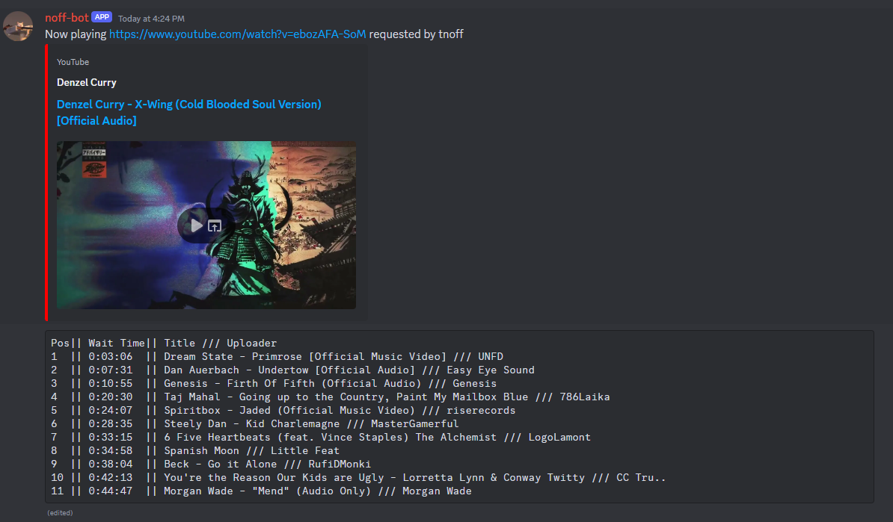

# Music Cog

Play audio from Youtube videos in voice chat. The bot can be called to join voice chat, and Youtube videos can be requested to be downloaded, processed, and played in the voice chat. Video audio will play one at a time and can be added to a queue to be played after the current video audio is played or skipped.

The bot is designed to be able to run on multiple servers at the same time.

## Inputs

Potential input includes
- A string that will be searched in Youtube and download the first result
- A direct Youtube link that will be downloaded
- A Spotify playlist or album (if Spotify credentials are given in the config)
- A Youtube playlist (if Youtube credentials are given in the config)

## Basic Usage

Once joined to a voice chat channel, call `!join` or `!awaken` to have the bot join the same voice channel you are in. Then enter `!play` with the input of the video you would like to listen to.


If multiple videos are requested, they will be downloaded and placed into the queue, which will be posted to the channel.



There is some logic to ensure that the queue messages are the most recent messages shown in the channel, for readability.

## Basic Functions

Other basic functions of music playing include

Skipping a video

```
!skip
```

Remove video from the queue
```
!remove <queue-position>
```

Bump video to the top of the queue

```
!bump <queue-position>
```

Stop the bot from playing audio and delete the queue

```
!stop
```

Show history of videos played by the bot during its current session

```
!history
```


If you would like to move the queue messages to a different channel, call `!move-messages` from the channel you'd like to move the messages to.

## Playlist Functions

If database creds are given to the bot, playlists can be created and updated to the server. This will allow you to save lists of Youtube videos to be played within the server. By default, a "history" playlist is created which adds previously played videos from the server. Anyone can queue these videos up in the server using:

```
!random-play
```

To list the current playlists

```
!playlist list
```

To create a custom playlist use:

```
!playlist create <name>
```

To add a specific video to a playlist:

```
!playlist item-add <playlist id> <video input>
```

To show the videos saved to a playlist

```
!playlist show
```

To queue up all vidoes in a playlist

```
!playlist queue <playlist id>
```

These can also be shuffled

```
!playlist queue <playlist id> shuffle
```


### Advance Playlist Features


To save all videos currently in the queue to a playlist

```
!playlist save-queue <playlist name>
```

To save all videos currently in the history to a playlist

```
!playlist save-history <playlist name>
```

To merge two playlists

```
!playlist merge <playlist one id> <playlist two id>
```

Remove an item from a playlist

```
!playlist item-remove <playlist id> <item id>
```

## Spotify Enablement

You can pass [Spotify API](https://developer.spotify.com/) credentials to the config to allow for Spotify playlists and albums to be given as input. This will request the track information from Spotify, then the bot will run a Youtube search for "`<artist name>` `<song name>`" in Youtube, and download the first result.

You can pass the Spotify credentials into the config:

```
music:
  download:
    spotify_credentials:
      client_id: secret-spotify-client
      client_secret: secret-spotify-client-secret
```

## Youtube Playlist Enablement

You can pass [Youtube API Key](https://developers.google.com/Youtube/v3/getting-started) credentials to the config to allow for Youtube playlists to be given as input. This will request all of the video Ids in the playlist and download all of them to the queue.

You can pass Youtube API credentials into the config:

```
music:
  download:
    youtube_api_key: secret-Youtube-api-key
```

## Multi Video Input Shuffles

Note that with either Spotify playlists/albums or Youtube playlist input, you can pass `shuffle` to the play input to have the videos shuffled.

```
!play <spotify-playlist-link> shuffle
```

## Under the Hood

All Youtube videos are downloaded by the bot via [yt-dlp](https://github.com/yt-dlp/yt-dlp). The video audio is then left on disk and deleted after the video is played. You can specify what directory the videos are downloaded to in the config:

```
music:
  download:
    cache:
      download_dir: /tmp/discord
```

Specifically when videos are downloaded, they go to the base directory of the download dir. A subdirectory is then created matching the server id, and a symlink is created between the video file and the server subdirectory, with the symlink endpoint given a random UUID. When a video is deleted, the symlink is deleted, and when the bot has not actively being used in any server, the download directory is cleared.

This is to ensure:
- A video can be played within a queue multiple times, and deleting it when the first iteration is over does not delete all files for the same video
- If the same video is downloaded by multiple servers, there is not contention over which player uses which file

Do to disk limitation you may wish to limit the queue size, max length of a video that can be played, max playlist size that can be used.

```
music:
  player:
    queue_max_size: 256
  playlist:
    server_playlist_max: 64
  download:
    max_song_length: 3600 # In seconds
```


### Caching

You can enable caching so that videos are not deleted automatically when all players are stopped on the server. The bot then has logic to use the previous download when the same video is then downloaded again. There can be a max cache number given that limits the number of videos downloaded at a time, which older/less played videos will be deleted.


```
music:
  download:
    cache:
      download_dir: /tmp/discord
      enable_cache_files: true
```

The videos downloaded will be stored in a `VideoCache` table within the database. The database will also store the relevant video metadata (such as title and duration) used by the bot later. The video is identified by the full URL of the download, and should be used with all extractors.

You can configure how many cached videos are stored on disk, with the video last used (sometimes called "iterated") being deleted first.

```
music:
  download:
    cache:
      max_cache_files: 2048
```

Additionally there is a `SearchString` table for storing search strings and their corresponding downloaded videos. By default this is only enabled on Spotify searches, since the Artist Name and Song Name used in these and the relevant video they correspond to should be static.

You can set how many entries you want in this table via `max_search_cache_entries`:

```
music:
  download:
    cache:
      max_search_cache_entries: 1024
```

Here is a diagram of how the layers of caching interact with each other:


### Audio Processing

You can also choose to enable audio processing, which will use FFMPEG to normalize the audio of all videos downloaded, since some Youtube videos have different volumes to them. This will also remove "dead air" from the start and end of videos after they are downloaded.


`ffmpeg` must be installed on the machine is using to be able to use this feature.

```
music:
  download:
    enable_audio_processing: true
```

Note that if audio processing is enabled alongside the cache, then two copies of each video will be stored. One for the original download, and another for the processed file.

### Extra YT-DLP Options

You can pass in extra options for the [yt-dlp](https://github.com/yt-dlp/yt-dlp/) client. These should be inputted as a dictionary/hash and will be passed in to the YTDLP client when the download client is created.

```
music:
  download:
    extra_ytdlp_options:
      proxy: http://localhost:8888
```

### YTDLP Wait Time

Add a minimum wait time being youtube extractor downloads with yt-dlp, along with a "variance" of random time to add in between. The variance is to make the traffic look more natural.

`youtube_wait_period_minimum` sets the minimum wait time, with `youtube_wait_period_max_variance` sets the variance. These are both in seconds.

The bot will then calculate:

```
min-wait-time + (random(1, max-variance))
```

The config should look like:

```
music:
  download:
    youtube_wait_period_minimum: 60
    youtube_wait_period_max_variance: 15
```

### Youtube Music Search

By default the bot will search Youtube Music for generic string inputs, filtering by songs. This is to get the best quality of upload possible. This is done via the [ytmusicapi package](https://github.com/sigma67/ytmusicapi).

This can be turned off:

```
music:
  download:
    enable_youtube_music_search: false
```

### Shuffles

By default all playlist/album downloads will be shuffled. The number of shuffles defaults to 5, but can be configured:

```
music:
  general:
    number_shuffles: 7
```