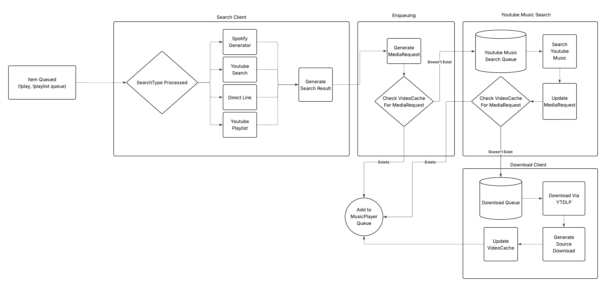

# Discord Bot Music Command Flow - From Command to Playback

## Overview

This document traces the complete flow from user commands (`!play`, `!playlist queue`) through the various system components until audio starts playing through the `MusicPlayer`. Understanding this flow is critical for debugging issues and adding new features.

Please consult this diagram for a visual reference: 

See [terminology.md](./terminology.md) for definitions of all components, types, and concepts referenced in this document.


## The Two Main Entry Points

### 1. **`!play` Command** - Direct Play

User types: `!play <search>`

**Examples**:
- `!play john prine paradise` - Text search
- `!play https://www.youtube.com/watch?v=aaaaa` - Direct YouTube URL (or any other media site url)
- `!play https://open.spotify.com/album/abc123` - Spotify album
- `!play https://www.youtube.com/playlist?list=xyz shuffle` - YouTube playlist

### 2. **`!playlist queue` Command** - Queue from Saved Playlist

User types: `!playlist queue <index> [shuffle] [max_num]`

**Examples**:
- `!playlist queue 0` - Queue entire playlist
- `!playlist queue 0 shuffle` - Queue playlist shuffled
- `!playlist queue 0 16` - Queue first 16 tracks
- `!playlist queue 0 shuffle 16` - Queue 16 random tracks

---

## Part 1: Command-Specific Processing

The two commands differ in how they obtain the list of tracks to play. After this phase, they converge into the same processing pipeline.

---

### Path A: `!play` Command Flow

#### **Phase 1A: Command Entry & Validation**

**Step 1.1: Validate User Voice State**

The command handler first checks if the user is in a voice channel:

```
play_() command invoked
    ↓
__check_author_voice_chat(ctx)
    ↓
Check: Is user in a voice channel?
    ↓
YES: Return voice channel
NO:  Send error message, exit
```

**Step 1.2: Ensure Player Exists**

If the user is in a valid voice channel, ensure a `MusicPlayer` exists for this guild:

```
__ensure_player(ctx, channel)
    ↓
get_player(guild_id, join_channel=channel, ctx=ctx)
    ↓
Check: Does player exist in self.players[guild_id]?
    ↓
YES: Return existing player
NO:  Create new player
```

**Player Creation Process**:
1. Create guild-specific directory for temp files
2. Get or create history playlist ID from database
3. Initialize `MusicPlayer` with:
   - Logger
   - Context (guild, channel, bot)
   - Cleanup callbacks
   - Queue max size
   - Disconnect timeout
   - File directory
   - Message queue reference
   - History playlist ID
4. Start player background task (`player_loop`)
5. Store in `self.players[guild_id]`
6. Join voice channel if provided

---

#### **Phase 2A: Search & URL Resolution**

**Step 2.1: Parse Search Input**

The search client analyzes the input to determine type:

```
search_client.check_source(search, loop, max_results)
    ↓
__check_source_types(search, loop)
    ↓
Pattern matching:
    - Spotify playlist? → Extract playlist ID
    - Spotify album? → Extract album ID
    - Spotify track? → Extract track ID
    - YouTube playlist? → Extract playlist ID
    - YouTube video URL? → Extract video ID
    - Plain text? → YouTube search
```

**Step 2.2: Fetch Multi-Track Sources**

For playlists/albums, fetch all tracks:

**Spotify Playlist/Album**:
```
spotify_client.playlist_tracks() or spotify_client.album_tracks()
    ↓
For each track:
    - Get track name and artist(s)
    - Create SearchResult with search_type=SPOTIFY
    - Format as "Artist - Track Name"
    - Store multi_search_input (playlist/album name)
```

**YouTube Playlist**:
```
youtube_client.get_playlist_items()
    ↓
For each video:
    - Get video URL
    - Create SearchResult with search_type=YOUTUBE_PLAYLIST
    - Store multi_search_input (playlist name)
```

**Single Track**:
```
Create single SearchResult
    ↓
Set search_type based on input:
    - DIRECT: Direct URL
    - YOUTUBE: YouTube video URL
    - SPOTIFY: Spotify track URL
    - SEARCH: Plain text search
```

**Step 2.3: Apply Shuffle & Max Results**

```
Check for 'shuffle' in search string
    ↓
If shuffle: random.shuffle(search_results)
    ↓
If max_results limit: search_results[:max_results]
```

---

#### **Phase 3A: Convert to Media Requests**

Convert each `SearchResult` to a `MediaRequest`:

```
For each SearchResult:
    Create MediaRequest(
        guild_id=ctx.guild.id,
        channel_id=ctx.channel.id,
        requester_name=ctx.author.display_name,
        requester_id=ctx.author.id,
        search_string=item.resolved_search_string,
        raw_search_string=item.raw_search_string,
        search_type=item.search_type
    )
    ↓
Add to media_requests list
```

**MediaRequest Fields**:
- `guild_id`, `channel_id` - Where to send updates
- `requester_name`, `requester_id` - Who requested
- `search_string` - Processed search (may be YouTube URL after YT Music search)
- `raw_search_string` - Original input
- `search_type` - SPOTIFY, DIRECT, SEARCH, YOUTUBE, etc.
- `uuid` - Unique identifier (auto-generated)
- `bundle_uuid` - Set later when added to bundle

---

### Path B: `!playlist queue` Command Flow

#### **Phase 1B: Command Entry & Validation**

**Step 1.1: Validate Prerequisites**

```
playlist_queue() command invoked
    ↓
__check_author_voice_chat(ctx)
    ↓
__check_database_session(ctx)
    ↓
__ensure_player(ctx, channel)
```

Same validation as `!play` flow for voice and player.

**Step 1.2: Parse Arguments**

```
Parse *args (variable arguments):
    ↓
For each arg:
    ├─ "shuffle"? → shuffle = True
    └─ Is digit? → max_num = int(arg)
```

Supports flexible argument order:
- `!playlist queue 0 shuffle 16`
- `!playlist queue 0 16 shuffle`

---

#### **Phase 2B: Retrieve Playlist from Database**

**Step 2.1: Get Playlist ID**

```
__get_playlist(playlist_index, ctx)
    ↓
Query database for playlist by index
    ↓
Returns (playlist_id, is_history)
```

**Step 2.2: Fetch Playlist Items**

```
__playlist_queue(ctx, player, playlist_id, shuffle, max_num, is_history)
    ↓
database_functions.list_playlist_items(db_session, playlist_id)
    ↓
For each PlaylistItem:
    Create MediaRequest(
        guild_id=ctx.guild.id,
        channel_id=ctx.channel.id,
        requester_name=ctx.author.display_name,
        requester_id=ctx.author.id,
        search_string=item.video_url,
        raw_search_string=item.video_url,
        search_type=YOUTUBE or DIRECT,
        added_from_history=is_history,
        history_playlist_item_id=item.id,
        display_name_override=item.title
    )
```

**Key Differences from `!play`**:
- `search_string` is already a YouTube URL (from database)
- `added_from_history` flag prevents re-adding to history
- `display_name_override` uses stored title instead of search string
- `history_playlist_item_id` tracks which history item to delete if requested

---

#### **Phase 3B: Apply Shuffle & Limit**

```
If shuffle:
    random.seed(time())
    random.shuffle(playlist_items)

If max_num:
    playlist_items = playlist_items[:max_num]
```

---

#### **Phase 4B: Update Database**

```
database_functions.update_playlist_queued_at(db_session, playlist_id)
    ↓
Sets playlist.queued_at = current timestamp
```

Tracks when playlist was last used.

---

## Part 2: Shared Processing Pipeline

**After the command-specific phases above, both `!play` and `!playlist queue` follow the exact same flow through the system.**

At this point, both commands have produced a list of `MediaRequest` objects that are ready to be processed.

---

### **Phase 1: Create Progress Bundle**

**Step 1.1: Initialize Message Bundle**

Before searching/downloading, create a bundle to track progress:

```
Create MultiMediaRequestBundle
    ↓
Set bundle.uuid (unique identifier)
    ↓
Store in self.multirequest_bundles[uuid]
    ↓
Call bundle.set_initial_search(search)
    ↓
Register bundle with MessageQueue
```

**What This Does**:
- Creates a unique UUID for this request batch
- Stores the original search string
- Queues initial message: "Processing search '<search>'"
- Prepares to track multiple media requests from one command

**Step 1.2: Update Bundle for Multi-Track**

For multi-track results (playlists, albums):

```
bundle.set_multi_input_request(proper_name=playlist_name)
    ↓
Updates message to show playlist name
Message: "Processing '<playlist name>'"
```

---

### **Phase 2: Enqueue Media Requests**

**Step 2.1: Route to Appropriate Queue**

```
enqueue_media_requests(ctx, media_requests, bundle, player)
    ↓
For each MediaRequest:
    ↓
Check search_type:
    ↓
    ├─ SPOTIFY or SEARCH?
    │   ↓
    │   Add to youtube_music_search_queue
    │   ↓
    │   bundle.add_media_request(stage=SEARCHING)
    │   ↓
    │   YouTube Music Search Loop will:
    │       - Convert to YouTube URL
    │       - Check cache
    │       - Add to download_queue
    │
    └─ DIRECT, YOUTUBE, or YOUTUBE_PLAYLIST?
        ↓
        Check cache via _enqueue_media_download_from_cache()
        ↓
        ├─ Cache HIT?
        │   ↓
        │   Create MediaDownload from cache
        │   ↓
        │   Add to player._play_queue
        │   ↓
        │   bundle.add_media_request(stage=COMPLETED)
        │
        └─ Cache MISS?
            ↓
            Add to download_queue
            ↓
            bundle.add_media_request(stage=QUEUED)
```

**Step 2.2: Finalize Bundle**

```
bundle.all_requests_added()
    ↓
Freeze pagination structure
    ↓
Build static row index mapping
    ↓
Update message queue
```

**Messages Sent**:
```
Processing "Spotify Album Name"
Media request queued for download: "Track 1"
Media request queued for download: "Track 2"
...
```

---

### **Phase 3: Background Processing**

Now the request enters background loops (see [background.md](./background.md) for details).

**For SPOTIFY/SEARCH requests**:

```
YouTube Music Search Loop
    ↓
Get (MediaRequest, channel) from youtube_music_search_queue
    ↓
search_client.search_youtube_music(raw_search_string)
    ↓
Convert result to YouTube URL: https://youtube.com/watch?v=...
    ↓
Update media_request.search_string = youtube_url
    ↓
Check cache again
    ↓
├─ Cache HIT: Add to player queue, mark COMPLETED
└─ Cache MISS: Add to download_queue, mark QUEUED
```

**For all requests that need downloading**:

```
Download Files Loop
    ↓
Get MediaRequest from download_queue
    ↓
Check if player still exists
    ↓
bundle.update_request_status(BACKOFF)
Message: "Waiting for youtube backoff..."
    ↓
Wait 30-40 seconds (rate limiting)
    ↓
bundle.update_request_status(IN_PROGRESS)
Message: "Downloading and processing: Track 1"
    ↓
download_client.download(search_string)
    ↓
├─ SUCCESS:
│   ├─ yt-dlp downloads file
│   ├─ Audio processing (if enabled)
│   ├─ Move to guild directory
│   └─ Add to cache database
│       ↓
│   Create MediaDownload object
│       ↓
│   ready_file() - Copy to guild-specific path with UUID name
│       ↓
│   Add to player._play_queue
│       ↓
│   bundle.update_request_status(COMPLETED)
│   Message: "" (row cleared)
│
└─ RETRYABLE ERROR (timeout, TLS error):
    ├─ Increment media_request.retry_count
    ├─ Check if retry_count < max_download_retries
    └─ If yes:
        ├─ bundle.update_request_status(RETRY)
        ├─ Message: "Failed, will retry: Track 1"
        ├─ Re-queue to download_queue
        └─ Process again later
    └─ If no:
        ├─ bundle.update_request_status(FAILED)
        └─ Message: "Media request failed download: <reason>"
```

---

### **Phase 4: Player Queue & Playback**

**Step 4.1: Add to Player Queue**

```
player.add_to_play_queue(media_download)
    ↓
player._play_queue.put_nowait(media_download)
    ↓
Update play order message queue
```

**Step 4.2: Player Loop Processes Queue**

The `MusicPlayer.player_loop()` runs continuously:

```
player_loop() (infinite loop)
    ↓
Wait for next track:
    - If queue empty: Wait with timeout
    - If timeout: Disconnect and cleanup
    - If item available: Continue
    ↓
source = await _play_queue.get()
    ↓
Set current_source = source
    ↓
Create FFmpegPCMAudio from source.file_path
    ↓
guild.voice_client.play(audio_source, after=set_next)
    ↓
Update "Now Playing" message
    ↓
Add to history queue (for analytics)
    ↓
Wait for track to finish (self.next.wait())
    ↓
Add to _history queue
    ↓
Delete temp file (source.delete())
    ↓
Loop to next track
```

---

## Key Decision Points

### **Cache Check**

Happens at multiple stages:

1. **After YouTube Music search** - Check if converted URL is cached
2. **Before download queue** - Check if direct URL is cached
3. **After download** - Add to cache for future use

**Benefits**:
- Skips 30+ second download wait
- Reduces YouTube API load
- Instant playback for popular songs

### **Queue Routing**

```
Is search a Spotify URL or plain text?
    ↓
YES: Route to youtube_music_search_queue
    ↓
    Search converts to YouTube URL
    ↓
    Then routes to download_queue

NO: Route directly to download_queue
    ↓
    Download immediately (after cache check)
```

**Why separate queues?**
- Search API calls are fast (100-500ms)
- Downloads are slow (30+ seconds with backoff)
- Allows batch searching while downloads happen in parallel

### **Bundle vs No Bundle**

**With Bundle** (multi-track):
- Progress tracking for each track
- Consolidated completion message
- Shows "3/10 completed" status

**Without Bundle** (single track):
- Simpler flow
- No progress tracking needed
- Direct success/failure message

---

## Player Queue States

The player queue (`_play_queue`) has several states:

### **Empty Queue**
```
No items in queue
    ↓
player_loop() waits with timeout
    ↓
If timeout (15 minutes): Disconnect from voice
```

### **Items Queuing**
```
Download loop adding items
    ↓
Player loop waiting for next item
    ↓
As items arrive, immediately start playing
```

### **Playing**
```
Current track playing
    ↓
Queue has upcoming tracks
    ↓
When current finishes, immediately play next
```

### **Shutdown**
```
Player.shutdown_called = True
    ↓
Stop accepting new queue items
    ↓
Finish current track
    ↓
Clear queue
    ↓
Disconnect from voice
    ↓
Clean up temp files
```

---

## Message Flow Integration

Throughout the flow, the messaging system provides real-time updates:

### **Initial Search**
```
"Processing search 'user input'"
```

### **Multi-Track Detection**
```
"Processing 'Playlist Name'"
0/10 media_requests processed, 0 failed
```

### **Queued for Download**
```
Media request queued for download: "Track 1"
Media request queued for download: "Track 2"
```

### **Download Progress**
```
Waiting for youtube backoff...
    ↓
Downloading and processing: "Track 1"
    ↓
(row cleared when complete)
```

### **Completion**
```
Completed processing of "Playlist Name"
10/10 media_requests processed, 0 failed
(deleted after 5 minutes)
```

See MESSAGING.md for details on how these messages are efficiently edited/deleted.

---

## Error Handling

### **User Not in Voice Channel**
```
Send error: "You must be in a voice channel to use this command"
Exit immediately
```

### **Search Exception**
```
search_client.check_source() raises SearchException
    ↓
bundle.set_multi_input_request(error_message=...)
    ↓
Display error to user
    ↓
Bundle marked finished
```

### **Download Failed**

**Retryable Errors** (network timeouts, TLS errors):
```
download_client.download() raises RetryableException
    ↓
media_request.retry_count is incremented
    ↓
Check: retry_count < max_download_retries?
    ↓
YES: Re-queue the request
    ↓
    bundle.update_request_status(RETRY)
    ↓
    Message: "Failed, will retry: <track name>"
    ↓
    Add back to download_queue
    ↓
    Process again later

NO: Treat as permanent failure
    ↓
    bundle.update_request_status(FAILED, failure_reason=...)
    ↓
    Message: "Media request failed download: <reason>"
```

**Non-Retryable Errors** (age restriction, private video, video unavailable):
```
download_client.download() raises DownloadClientException
    ↓
bundle.update_request_status(FAILED, failure_reason=...)
    ↓
Message: "Media request failed download: <reason>"
    ↓
Continue processing other tracks
```

### **Queue Full**
```
_play_queue.put_nowait() raises QueueFull
    ↓
bundle.update_request_status(FAILED, "play queue is full")
    ↓
Stop adding more items to queue
```

### **Player Disconnected**
```
Player no longer exists when download completes
    ↓
bundle.update_request_status(DISCARDED)
    ↓
Skip adding to queue
```

---

## Summary: Complete Flow Diagram

```
User Command (!play or !playlist queue)
    ↓
┌───────────────────────────────────────────────────────────┐
│ COMMAND-SPECIFIC PROCESSING                               │
├───────────────────────────────────────────────────────────┤
│ Path A: !play                │ Path B: !playlist queue    │
│   - Validate voice channel   │   - Validate voice channel │
│   - Ensure player exists     │   - Ensure player exists   │
│   - Search/parse input       │   - Parse arguments        │
│   - Fetch from APIs          │   - Fetch from database    │
│   - Apply shuffle/max        │   - Apply shuffle/max      │
│   - Create MediaRequests     │   - Create MediaRequests   │
└───────────────┬──────────────┴────────────┬───────────────┘
                │                           │
                └───────────┬───────────────┘
                            ↓
┌───────────────────────────────────────────────────────────┐
│ SHARED PROCESSING PIPELINE                                │
└───────────────────────────────────────────────────────────┘
    ↓
Create MultiMediaRequestBundle for progress tracking
    ↓
Enqueue each MediaRequest:
    ├─ Check cache first
    │   └─ HIT: Add directly to player._play_queue
    ├─ SPOTIFY/SEARCH: Add to youtube_music_search_queue
    │   └─ Search Loop converts to YouTube URL → download_queue
    └─ DIRECT/YOUTUBE: Add to download_queue
    ↓
Download Loop processes downloads:
    ├─ Wait for rate limit (30s+)
    ├─ Download via yt-dlp
    ├─ Process audio (if enabled)
    ├─ Add to cache
    └─ Create MediaDownload object
    ↓
Add MediaDownload to player._play_queue
    ↓
Player Loop:
    ├─ Get next item from _play_queue
    ├─ Create FFmpegPCMAudio source
    ├─ voice_client.play(audio_source)
    ├─ Update "Now Playing" message
    ├─ Wait for track to finish
    ├─ Add to history
    ├─ Delete temp file
    └─ Loop to next track
```

---

## Key Takeaways

1. **Two Entry Points, One Pipeline**: `!play` and `!playlist queue` differ only in how they obtain tracks, then merge into identical processing
2. **Two-Queue System**: YouTube Music search queue → Download queue → Player queue
3. **Cache-First**: Always check cache before downloading
4. **Background Processing**: User commands return immediately, loops handle heavy work
5. **Progress Tracking**: Bundles track multi-request operations with real-time updates
6. **Player Independence**: Each guild has independent MusicPlayer with own queue
7. **Graceful Degradation**: Errors in one track don't affect others in batch
8. **Resource Cleanup**: Temp files deleted after playback, players cleaned up on disconnect

This architecture enables concurrent multi-guild operation with efficient resource usage and comprehensive user feedback.
