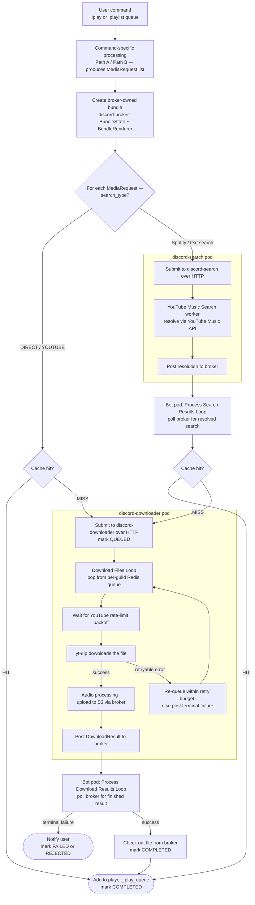

# Discord Bot Music Command Flow - From Command to Playback

## Overview

This document traces the complete flow from user commands (`!play`, `!playlist queue`) through the various system components until audio starts playing through the `MusicPlayer`. Understanding this flow is critical for debugging issues and adding new features.

The diagram below traces a `MediaRequest` from the command that created it
through to the moment it's added to the player queue — the cache check,
`discord-search` (for text/Spotify input), and `discord-downloader` (for
anything not already cached) are the three places the request can take a
different path. Part 2 below covers the same ground step by step.


```mermaid
flowchart TD
    CMD["User command<br/>!play or !playlist queue"] --> CONVERGE["Command-specific processing<br/>Path A / Path B — produces MediaRequest list"]
    CONVERGE --> BUNDLE["Create broker-owned bundle<br/>discord-broker: BundleState + BundleRenderer"]
    BUNDLE --> ROUTE{"For each MediaRequest —<br/>search_type?"}

    ROUTE -->|"DIRECT / YOUTUBE"| CACHE1{"Cache hit?"}
    CACHE1 -->|HIT| PLAYQ(["Add to player._play_queue<br/>mark COMPLETED"])
    CACHE1 -->|MISS| DLSUBMIT["Submit to discord-downloader over HTTP<br/>mark QUEUED"]

    ROUTE -->|"Spotify / text search"| SEARCHSUBMIT["Submit to discord-search over HTTP"]

    subgraph SEARCH["discord-search pod"]
        SEARCHSUBMIT --> YTMSEARCH["YouTube Music Search worker<br/>resolve via YouTube Music API"]
        YTMSEARCH --> POSTSEARCH["Post resolution to broker"]
    end

    POSTSEARCH --> PSRLOOP["Bot pod: Process Search Results Loop<br/>poll broker for resolved search"]
    PSRLOOP --> CACHE2{"Cache hit?"}
    CACHE2 -->|HIT| PLAYQ
    CACHE2 -->|MISS| DLSUBMIT

    subgraph DOWNLOAD["discord-downloader pod"]
        DLLOOP["Download Files Loop<br/>pop from per-guild Redis queue"]
        DLSUBMIT --> DLLOOP
        DLLOOP --> BACKOFF["Wait for YouTube rate-limit backoff"]
        BACKOFF --> YTDLP["yt-dlp downloads the file"]
        YTDLP -->|success| UPLOAD["Audio processing ·<br/>upload to S3 via broker"]
        YTDLP -->|retryable error| RETRY["Re-queue within retry budget,<br/>else post terminal failure"]
        RETRY --> DLLOOP
        UPLOAD --> POSTRESULT["Post DownloadResult to broker"]
    end

    POSTRESULT --> PDRLOOP["Bot pod: Process Download Results Loop<br/>poll broker for finished result"]
    PDRLOOP -->|terminal failure| FAIL(["Notify user<br/>mark FAILED or REJECTED"])
    PDRLOOP -->|success| CHECKOUT["Check out file from broker<br/>mark COMPLETED"]
    CHECKOUT --> PLAYQ
```

See [terminology.md](./terminology.md) for definitions of all components, types, and concepts referenced in this document.


## The Two Main Entry Points

### 1. **`!play` Command** - Direct Play

User types: `!play <search>`

**Examples**:
- `!play john prine paradise` - Text search
- `!play https://www.youtube.com/watch?v=aaaaa` - Direct YouTube URL (or any other media site url)
- `!play https://open.spotify.com/album/abc123` - Spotify album
- `!play https://www.youtube.com/playlist?list=xyz shuffle` - YouTube playlist

### 2. **`!playlist queue` Command** - Queue from Saved Playlist

User types: `!playlist queue <index> [shuffle] [max_num]`

**Examples**:
- `!playlist queue 0` - Queue entire playlist
- `!playlist queue 0 shuffle` - Queue playlist shuffled
- `!playlist queue 0 16` - Queue first 16 tracks
- `!playlist queue 0 shuffle 16` - Queue 16 random tracks

---

## Part 1: Command-Specific Processing

The two commands differ in how they obtain the list of tracks to play. After this phase, they converge into the same processing pipeline.

---

### Path A: `!play` Command Flow

#### **Phase 1A: Command Entry & Validation**

**Step 1.1: Validate User Voice State**

The command handler first checks if the user is in a voice channel:

```
play_() command invoked
    ↓
__check_author_voice_chat(ctx)
    ↓
Check: Is user in a voice channel?
    ↓
YES: Return voice channel
NO:  Send error message, exit
```

**Step 1.2: Ensure Player Exists**

If the user is in a valid voice channel, ensure a `MusicPlayer` exists for this guild:

```
__ensure_player(ctx, channel)
    ↓
get_player(guild_id, join_channel=channel, ctx=ctx)
    ↓
Check: Does player exist in self.players[guild_id]?
    ↓
YES: Return existing player
NO:  Create new player
```

**Player Creation Process**:
1. Create guild-specific directory for temp files
2. Get or create history playlist ID from database
3. Initialize `MusicPlayer` with:
   - Logger
   - Context (guild, channel, bot)
   - Cleanup callbacks
   - Queue max size
   - Disconnect timeout
   - File directory
   - Message queue reference
   - History playlist ID
4. Start player background task (`player_loop`)
5. Store in `self.players[guild_id]`
6. Join voice channel if provided

---

#### **Phase 2A: Search & URL Resolution**

**Step 2.1: Parse Search Input**

The search client analyzes the input to determine type:

```
search_client.check_source(search, loop, max_results)
    ↓
__check_source_types(search, loop)
    ↓
Pattern matching:
    - Spotify playlist? → Extract playlist ID
    - Spotify album? → Extract album ID
    - Spotify track? → Extract track ID
    - YouTube playlist? → Extract playlist ID
    - YouTube video URL? → Extract video ID
    - Plain text? → YouTube search
```

**Step 2.2: Fetch Multi-Track Sources**

For playlists/albums, fetch all tracks:

**Spotify Playlist/Album**:
```
spotify_client.playlist_tracks() or spotify_client.album_tracks()
    ↓
For each track:
    - Get track name and artist(s)
    - Create SearchResult with search_type=SPOTIFY
    - Format as "Artist - Track Name"
    - Store collection_name (playlist/album name)
```

**YouTube Playlist**:
```
youtube_client.get_playlist_items()
    ↓
For each video:
    - Get video URL
    - Create SearchResult with search_type=YOUTUBE_PLAYLIST
    - Store collection_name (playlist name)
```

**Single Track**:
```
Create single SearchResult
    ↓
Set search_type based on input:
    - DIRECT: Direct URL
    - YOUTUBE: YouTube video URL
    - SPOTIFY: Spotify track URL
    - SEARCH: Plain text search
```

**Step 2.3: Apply Shuffle & Max Results**

```
Check for 'shuffle' in search string
    ↓
If shuffle: random.shuffle(search_results)
    ↓
If max_results limit: search_results[:max_results]
```

---

#### **Phase 3A: Convert to Media Requests**

Convert each `SearchResult` to a `MediaRequest`:

```
For each SearchResult:
    Create MediaRequest(
        guild_id=ctx.guild.id,
        channel_id=ctx.channel.id,
        requester_name=ctx.author.display_name,
        requester_id=ctx.author.id,
        search_result=item,   -- the SearchResult itself, embedded, not flattened
    )
    ↓
Add to media_requests list
```

**MediaRequest Fields** (`discord_core/types/media_request.py`):
- `guild_id`, `channel_id` - Where to send updates
- `requester_name`, `requester_id` - Who requested
- `search_result` - A `SearchResult` (`discord_core/types/search.py`), not
  flat fields: `search_type`, `raw_search_string` (original input),
  `youtube_music_search_string` (set after YT Music search resolves it —
  there is no `search_string` field to overwrite in place any more), `proper_name`
- `uuid` - Unique identifier (auto-generated)
- `bundle_uuid` - Set later when added to bundle

---

### Path B: `!playlist queue` Command Flow

#### **Phase 1B: Command Entry & Validation**

**Step 1.1: Validate Prerequisites**

```
playlist_queue() command invoked
    ↓
__check_author_voice_chat(ctx)
    ↓
__check_database_session(ctx)
    ↓
__ensure_player(ctx, channel)
```

Same validation as `!play` flow for voice and player.

**Step 1.2: Parse Arguments**

```
Parse *args (variable arguments):
    ↓
For each arg:
    ├─ "shuffle"? → shuffle = True
    └─ Is digit? → max_num = int(arg)
```

Supports flexible argument order:
- `!playlist queue 0 shuffle 16`
- `!playlist queue 0 16 shuffle`

---

#### **Phase 2B: Retrieve Playlist from Database**

**Step 2.1: Get Playlist ID**

```
__get_playlist(playlist_index, ctx)
    ↓
Query database for playlist by index
    ↓
Returns (playlist_id, is_history)
```

**Step 2.2: Fetch Playlist Items**

```
__playlist_queue(ctx, player, playlist_id, shuffle, max_num, is_history)
    ↓
self.playlist_store.get_playlist(playlist_id)   -- HTTP call to discord-db
self.playlist_store.list_items(playlist_id)     -- HTTP call to discord-db
    ↓
For each item:
    Create MediaRequest(
        guild_id=ctx.guild.id,
        channel_id=ctx.channel.id,
        requester_name=ctx.author.display_name,
        requester_id=ctx.author.id,
        search_result=SearchResult(
            search_type=YOUTUBE if check_youtube_video(item.video_url) else DIRECT,
            raw_search_string=item.video_url,
            proper_name=item.title,
        ),
        added_from_history=is_history,
        history_playlist_item_id=item.id,
    )
```

**Key Differences from `!play`**: the reads happen over HTTP against
`discord-db` rather than a local session (the bot holds no database
connection at all), and:
- `raw_search_string` is already a YouTube URL (from the stored playlist item)
- `added_from_history` flag prevents re-adding to history
- `proper_name` on `SearchResult` uses stored title instead of search string for display
- `history_playlist_item_id` tracks which history item to delete if requested

---

#### **Phase 3B: Apply Shuffle & Limit**

```
If shuffle:
    random.seed(time())
    random.shuffle(playlist_items)

If max_num:
    playlist_items = playlist_items[:max_num]
```

---

#### **Phase 4B: Update Database**

```
database_functions.update_playlist_queued_at(db_session, playlist_id)
    ↓
Sets playlist.queued_at = current timestamp
```

Tracks when playlist was last used.

---

## Part 2: Shared Processing Pipeline

**After the command-specific phases above, both `!play` and `!playlist queue` follow the exact same flow through the system.**

At this point, both commands have produced a list of `MediaRequest` objects that are ready to be processed.

---

> **This whole section (Part 2) was rewritten against current source**
> (`discord_gateway/cogs/music.py`, `discord_gateway/cogs/music_helpers/music_player.py`)
> rather than patched — the original described an entirely in-process
> pipeline (a local `download_queue`/`youtube_music_search_queue`, bundles
> stored in `self.multirequest_bundles`, `FFmpegPCMAudio`) that predates the
> HA pod split. The overall shape (bundle → enqueue → background processing
> → player queue) is unchanged; almost every mechanism underneath it is not.

### **Phase 1: Create Progress Bundle**

**Step 1.1: Initialize Message Bundle**

Before searching/downloading, create a bundle to track progress. Bundle
state is not stored on the cog any more — it is owned by the broker pod
(`discord-broker`), so it survives independently of any one bot process:

```
self.create_bundle(guild_id, channel_id, ...)
    ↓
self.broker_client.create_bundle(...)  -- HTTP call to discord-broker
    ↓
Broker creates a BundleState + BundleRenderer, returns bundle_uuid
    ↓
Queues initial message: "Processing search '<search>'"
```

**What This Does**:
- Creates a unique UUID for this request batch
- Stores the original search string
- Queues initial message: "Processing search '<search>'"
- Prepares to track multiple media requests from one command

**Step 1.2: Update Bundle for Multi-Track**

For multi-track results (playlists, albums):

```
bundle.set_multi_input_request(proper_name=playlist_name)
    ↓
Updates message to show playlist name
Message: "Processing '<playlist name>'"
```

---

### **Phase 2: Enqueue Media Requests**

**Step 2.1: Route to Appropriate Queue**

```
enqueue_media_requests(ctx, entries, bundle_uuid, player)
    ↓
For each MediaRequest:
    ↓
    Set media_request.bundle_uuid; register it with the broker
    (broker_client.register_request() -- HTTP call, auto-attaches to the bundle)
    ↓
Check media_request.search_result.search_type:
    ↓
    ├─ NOT DIRECT or YOUTUBE (i.e. Spotify or a text search)?
    │   ↓
    │   Submit to the discord-search pod over HTTP
    │   (youtube_music_search_client.submit(), which enqueues per-guild Redis work)
    │   ↓
    │   discord-search's Process Search Results Loop, running in the bot pod,
    │   will later pick up the resolution -- see background.md
    │
    └─ DIRECT or YOUTUBE?
        ↓
        Check cache via _enqueue_media_download_from_cache()
        ↓
        ├─ Cache HIT?
        │   ↓
        │   Create MediaDownload from cache, add to player._play_queue
        │   ↓
        │   Push a COMPLETED lifecycle event (the broker's bundle counts it)
        │
        └─ Cache MISS?
            ↓
            Submit to the discord-downloader pod over HTTP
            (download_client.submit())
            ↓
            Push a QUEUED lifecycle event
```

On `PutsBlocked` (shutdown in progress) the whole bundle is deleted and the
enqueue aborts; on `QueueFull` the individual request is marked `DISCARDED`
and enqueue continues with the rest.

**Step 2.2: Finalize Bundle**

```
broker_client.finalize_bundle(bundle_uuid)  -- HTTP call to discord-broker
    ↓
Broker locks the bundle's pagination and triggers a final render
```

**Messages Sent**:
```
Processing "Spotify Album Name"
Media request queued for download: "Track 1"
Media request queued for download: "Track 2"
...
```

---

### **Phase 3: Background Processing**

The request now crosses pod boundaries. This is the biggest structural
change from the pre-HA design: search and download run as their own pods,
not background tasks in the bot's own process (see
[background.md](./background.md) for the full loop reference).

**For Spotify/text-search requests — in the `discord-search` pod, then back in the bot pod**:

```
discord-search pod: YouTube Music Search worker
    ↓
Resolve search string via YouTube Music API
    ↓
Convert result to YouTube URL: https://youtube.com/watch?v=...
    ↓
Post the resolution back to the broker
    ↓
--- pod boundary ---
    ↓
Bot pod: Process Search Results Loop (process_search_results)
    ↓
Poll the broker for the next resolved search
    ↓
Check cache again
    ↓
├─ Cache HIT: Add to player queue, mark COMPLETED
└─ Cache MISS: Submit to discord-downloader over HTTP, mark QUEUED
```

**For all requests that need downloading — in the `discord-downloader` pod, then back in the bot pod**:

```
discord-downloader pod: Download Files Loop
    ↓
Pop next request from its per-guild Redis queue
    ↓
Wait for YouTube rate-limit backoff
Message (via broker): "Waiting for youtube backoff..."
    ↓
Message: "Downloading and processing: Track 1"
    ↓
yt-dlp downloads the file
    ↓
├─ SUCCESS:
│   ├─ Audio processing (if enabled)
│   ├─ Upload to S3 via the broker (or keep local, depending on config)
│   └─ Post the completed DownloadResult back to the broker
│
└─ RETRYABLE ERROR (timeout, TLS error):
    ├─ Handled inside the downloader's own worker/retry budget
    ├─ Re-queued for another attempt if under the retry budget
    └─ Otherwise posted back as a terminal failure
    ↓
--- pod boundary ---
    ↓
Bot pod: Process Download Results Loop (process_download_results)
    ↓
Poll the broker for the next finished result
    ↓
├─ Terminal failure: distinguish a rejection (video declined) from a
│  genuine fault, notify the user, mark FAILED
└─ Success: check out the file from the broker (S3 or local), add to
   player._play_queue, mark COMPLETED
```

---

### **Phase 4: Player Queue & Playback**

**Step 4.1: Add to Player Queue**

```
player.add_to_play_queue(media_download)
    ↓
player._play_queue.put_nowait(media_download)
    ↓
Update play order message queue
```

**Step 4.2: Player Loop Processes Queue**

The `MusicPlayer.player_loop()` runs continuously:

```
player_loop() (infinite loop)
    ↓
Wait for next track:
    - If queue empty: Wait with timeout
    - If timeout: Disconnect and cleanup
    - If item available: Continue
    ↓
media_download = await _play_queue.get()
    ↓
Check out the file from the broker (self.broker.checkout) -- S3 fetch or
local copy, resolved to a local file_path; skip the track if no file
resolves (e.g. broker has no entry yet)
    ↓
Read the whole file into memory: BytesIO(open(file_path, 'rb').read())
    ↓
audio_source = PCMAudio(audio_data)   -- NOT FFmpegPCMAudio; no ffmpeg
                                          subprocess, no streaming from disk
    ↓
Set current_audio_source = audio_source
    ↓
voice_client.play(audio_source, after=set_next)
    ↓
Update "Now Playing" message
    ↓
Add to history queue (for analytics)
    ↓
Wait for track to finish (self.next.wait())
    ↓
Release the file from the broker (self.broker.release)
    ↓
Loop to next track
```

---

## Key Decision Points

### **Cache Check**

Happens at multiple stages:

1. **After YouTube Music search** - Check if converted URL is cached
2. **Before download queue** - Check if direct URL is cached
3. **After download** - Add to cache for future use

**Benefits**:
- Skips 30+ second download wait
- Reduces YouTube API load
- Instant playback for popular songs

### **Queue Routing**

```
Is search a Spotify URL or plain text?
    ↓
YES: Submit to the discord-search pod
    ↓
    Search converts to YouTube URL
    ↓
    Bot's Process Search Results Loop then submits to discord-downloader

NO: Submit directly to the discord-downloader pod
    ↓
    Download immediately (after cache check)
```

**Why separate queues?**
- Search API calls are fast (100-500ms)
- Downloads are slow (30+ seconds with backoff)
- Allows batch searching while downloads happen in parallel

### **Bundle vs No Bundle**

**With Bundle** (multi-track):
- Progress tracking for each track
- Consolidated completion message
- Shows "3/10 completed" status

**Without Bundle** (single track):
- Simpler flow
- No progress tracking needed
- Direct success/failure message

---

## Player Queue States

The player queue (`_play_queue`) has several states:

### **Empty Queue**
```
No items in queue
    ↓
player_loop() waits with timeout
    ↓
If timeout (15 minutes): Disconnect from voice
```

### **Items Queuing**
```
Download loop adding items
    ↓
Player loop waiting for next item
    ↓
As items arrive, immediately start playing
```

### **Playing**
```
Current track playing
    ↓
Queue has upcoming tracks
    ↓
When current finishes, immediately play next
```

### **Shutdown**
```
Player.shutdown_called = True
    ↓
Stop accepting new queue items
    ↓
Finish current track
    ↓
Clear queue
    ↓
Disconnect from voice
    ↓
Clean up temp files
```

---

## Message Flow Integration

Throughout the flow, the messaging system provides real-time updates:

### **Initial Search**
```
"Processing search 'user input'"
```

### **Multi-Track Detection**
```
"Processing 'Playlist Name'"
0/10 media_requests processed, 0 failed
```

### **Queued for Download**
```
Media request queued for download: "Track 1"
Media request queued for download: "Track 2"
```

### **Download Progress**
```
Waiting for youtube backoff...
    ↓
Downloading and processing: "Track 1"
    ↓
(row cleared when complete)
```

### **Completion**
```
Completed processing of "Playlist Name"
10/10 media_requests processed, 0 failed
(deleted after 5 minutes)
```

See [messaging.md](../messaging.md) for details on how these messages are efficiently edited/deleted.

---

## Error Handling

### **User Not in Voice Channel**
```
Send error: "You must be in a voice channel to use this command"
Exit immediately
```

### **Search Exception**
```
search_client.check_source() raises SearchException
    ↓
bundle.set_multi_input_request(error_message=...)
    ↓
Display error to user
    ↓
Bundle marked finished
```

### **Download Failed**

**Retryable Errors** (network timeouts, TLS errors) — handled entirely
inside the `discord-downloader` pod's own worker, not by the bot:
```
yt-dlp raises RetryableException
    ↓
retry_count is incremented (see retry_backoff.md for the budget math)
    ↓
Check: retry_count < max_download_retries?
    ↓
YES: Re-queued for another attempt inside the downloader pod
    ↓
    Message (via broker): "Failed, will retry: <track name>"

NO: Posted back to the broker as a terminal failure
    ↓
    Message: "Media request failed download: <reason>"
```

Only successes and terminal failures ever reach the bot's
`process_download_results` loop; retryable errors never leave the
downloader pod.

**Non-Retryable Errors** (age restriction, private video, video unavailable):
```
yt-dlp raises a rejection-class exception
    ↓
Posted back to the broker as a terminal failure, tagged as a rejection
    ↓
Bot pod: process_download_results distinguishes rejection from fault
    ↓
Message: "Media request rejected: <name>"
    ↓
Continue processing other tracks
```

These are *rejections*, not failures: the pipeline looked at the video and
declined it (`is_rejection()` in `types/download.py` lists the error types).
They bump the bundle's `rejected` counter instead of `failed`, and
`process_download_results` leaves its consumer span `OK` so the span
error-rate alert doesn't page on ordinary user input.

### **Queue Full**
```
_play_queue.put_nowait() raises QueueFull
    ↓
self._push_state(media_request, LifecycleEvent.DISCARDED)  -- notifies the broker's bundle
    ↓
Stop adding more items to queue
```

### **Player Disconnected**
```
Player no longer exists when download completes
    ↓
self._push_state(media_request, LifecycleEvent.DISCARDED)
    ↓
Skip adding to queue
```

---

## Summary: Complete Flow Diagram

```
User Command (!play or !playlist queue)
    ↓
┌───────────────────────────────────────────────────────────┐
│ COMMAND-SPECIFIC PROCESSING                               │
├───────────────────────────────────────────────────────────┤
│ Path A: !play                │ Path B: !playlist queue    │
│   - Validate voice channel   │   - Validate voice channel │
│   - Ensure player exists     │   - Ensure player exists   │
│   - Search/parse input       │   - Parse arguments        │
│   - Fetch from APIs          │   - Fetch from database    │
│   - Apply shuffle/max        │   - Apply shuffle/max      │
│   - Create MediaRequests     │   - Create MediaRequests   │
└───────────────┬──────────────┴────────────┬───────────────┘
                │                           │
                └───────────┬───────────────┘
                            ↓
┌───────────────────────────────────────────────────────────┐
│ SHARED PROCESSING PIPELINE                                │
└───────────────────────────────────────────────────────────┘
    ↓
Create a broker-owned bundle (BundleState/BundleRenderer) for progress tracking
    ↓
Enqueue each MediaRequest:
    ├─ Check cache first
    │   └─ HIT: Add directly to player._play_queue
    ├─ Spotify/text search: submit to the discord-search pod over HTTP
    │   └─ Search worker converts to YouTube URL → posts to broker →
    │      bot's Process Search Results Loop submits to discord-downloader
    └─ Direct/YouTube URL: submit to the discord-downloader pod over HTTP
    ↓
discord-downloader pod processes downloads:
    ├─ Wait for rate limit (30s+)
    ├─ Download via yt-dlp
    ├─ Process audio (if enabled)
    ├─ Upload to S3 / hand off to the broker
    └─ Post the DownloadResult back to the broker
    ↓
Bot pod: Process Download Results Loop checks out the file from the broker,
adds MediaDownload to player._play_queue
    ↓
Player Loop:
    ├─ Get next item from _play_queue
    ├─ Check out the file from the broker, read into memory
    ├─ Create PCMAudio source (not FFmpegPCMAudio)
    ├─ voice_client.play(audio_source)
    ├─ Update "Now Playing" message
    ├─ Wait for track to finish
    ├─ Add to history
    ├─ Release the file back to the broker
    └─ Loop to next track
```

---

## Key Takeaways

1. **Two Entry Points, One Pipeline**: `!play` and `!playlist queue` differ only in how they obtain tracks, then merge into identical processing
2. **Three Pods, Not One Process**: search (discord-search) → download (discord-downloader) → player (the bot), coordinated through the broker (discord-broker), not in-process queues
3. **Cache-First**: Always check cache before downloading
4. **Background Processing**: User commands return immediately, loops handle heavy work
5. **Progress Tracking**: Bundles track multi-request operations with real-time updates
6. **Player Independence**: Each guild has independent MusicPlayer with own queue
7. **Graceful Degradation**: Errors in one track don't affect others in batch
8. **Resource Cleanup**: Temp files deleted after playback, players cleaned up on disconnect

This architecture enables concurrent multi-guild operation with efficient resource usage and comprehensive user feedback.
