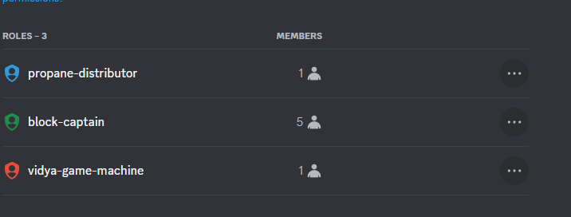
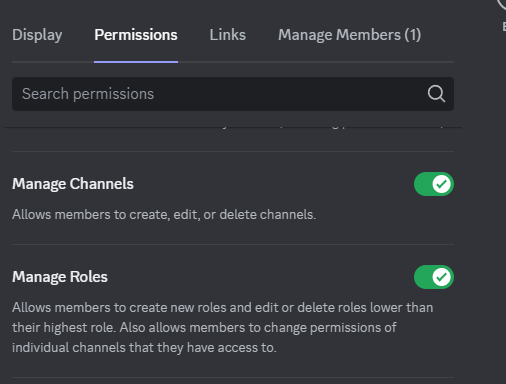

# Role Cog

A bot to help with discord role management. All discord roles are set in a hierarchical order, shown in a top to bottom view in the UI. Each role has a corresponding "rank" that matches with their position.




If one of these roles is given the "Manage Roles" command, then they can add/remove users to roles for all roles with a lower rank than the highest role they have with the "Manage Roles" permission.



For most servers this probably isn't a real problem, but for some larger server setups this can become problematic. You may want to only give roles permission to govern the users in only other particular roles. This is the sort situation this cog is designed for.

## Intents

Note that to use all functions, this cog requires the `members` intent.

## Example Scenario

Take the following scenario, you have a discord server setup with multiple sub type organizations. Say you have a "Tech Team", "Sales Team", and "QA Team". You want to have roles to govern members of each team. You want to be able to give the Tech Team ability to add members to their role, sales team their own role, and QA team their own role.

If you had the roles in the following rank order:
- Moderators
- Tech Team
- Sales Team
- QA Team
- @everyone

If you gave the "Tech Team" the Manage Role permissions, they would have permissions to add users to the Sales Team and the QA Team as well, which is not ideal.


## Setup

For the cog to work as intendend, you will need to set up the bot with a specific user with a role higher than the roles you want to manage with the bot. In the previous example, if you want to manage the "Tech Team", "Sales Team", and "QA Team" roles with the bot, you can set up a "Bot" role with the following rank:

- Moderators
- Bot
- Tech Team
- Sales Team
- QA Team
- @everyone

Since the bot has the Bot role, the bot will be able to manage the roles beneath its own role, as intended. For all of the following commands, the bot will update the roles, meaning that users calling the bot will not necessarily need to have the role permissions. The bot will add roles to the user given its config and what is allowed.


## Config Setup

### Basic Control Their Own Role

For the following example, if you want roles to be able to add/remove users from their own role, you can setup the following


```
role:
  1234: # server id
    role_manages:
      4567: # Tech Team Role ID
        manages:
          - 4567 # Tech Team Role ID
```

So here the "Tech Team" can add/remove users from this role.

If you want to make it so users can only add/remove themselves, you can add the `only_self` field.


```
role:
  1234: # server id
    role_manages:
      4567: # Tech Team Role ID
        manages:
          - 4567 # Tech Team Role ID
        only_self: true
```

### Basic Control Other Roles

You can also have it so roles can add/remove users to other roles. For example to give "Tech Team" control over the "Tech Team" role and the "QA Team" role.

```
role:
  1234: # server id
    role_manages:
      4567: # Tech Team Role ID
        manages:
          - 4567 # Tech Team Role ID
          - 8901 # QA Team Role ID
```


### Required Roles

You can setup a "required role" that sets a role that a user must have to be added/removed from any roles. A common use case of this feature would be if you're server has a generic role added to users as they are onboarded.


```
role:
  1234: # server id
    role_manages:
      require_roles:
        - 2468 # User must have this role to be added/removed from other roles
      4567: # Tech Team Role ID
        manages:
          - 4567 # Tech Team Role ID
          - 8901 # QA Team Role ID
```

### Reject List

You can setup a "rejected role" that sets a role that if a user has, will reject all role commands if called. This can be helpful if you want to outright reject the `@everyone` role for example.


```
role:
  1234: # server id
    role_manages:
      reject_list:
        - - 3692 # Reject those with this role from  being adding/removed from teams 
      4567: # Tech Team Role ID
        manages:
          - 4567 # Tech Team Role ID
          - 8901 # QA Team Role ID
```

### Override Roles

You can add roles to the override roles list to allow users with this role to add/remove a user from ANY role. This is useful for moderators.

```
role:
  1234: # server id
    role_manages:
      override_roles:
        - 8974 # Allow this role to add/remove any user from any role bot has control over
      4567: # Tech Team Role ID
        manages:
          - 4567 # Tech Team Role ID
          - 8901 # QA Team Role ID
```

## Basic Role Commands

Then you can use commands like
```
!role list # list all roles
!role available # list roles user controls
!role add @user @role # add user to role
!role remove @user @role # remove user from role
```

## Terms

An overview of terms again

- "Required Role" - You must have this role to use the bot for any role
- "Managed Role" - A role "managed" by another role, where the role that manages can add/remove users from
- "only self" - Users can only add/remove themselves from this role
- "Rejected Roles" - Roles not listed at all in any context
- "Override Roles" - Role which can add/remove any role to any user w/o checks