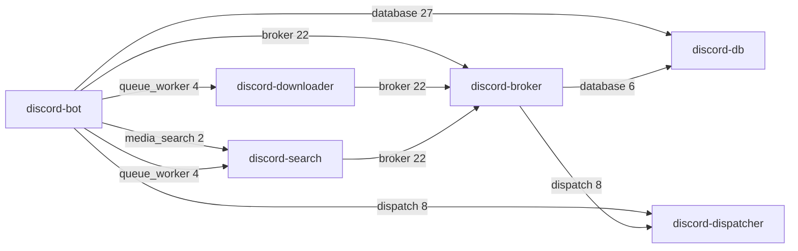

# Which pod calls which

<!-- GENERATED by tests/cli/test_seam_topology.py. Do not edit by hand.
     Regenerate with: UPDATE_SEAM_TOPOLOGY=1 pytest tests/cli/test_seam_topology.py -->

The pod-to-pod HTTP topology, derived from the `SEAM` / `ROUTES_CALLED`
declarations the runtime route check already reads and from the registry each
server module imports. Measured by importing each image entrypoint in a clean
interpreter. Nothing here is hand-maintained and there is no prefix-to-pod map
written down anywhere, so it cannot drift from the registries.

## The graph

Edges are labelled with the seam and the number of routes the caller claims
on it.

**A seam is a route shape, not a pod.** Four of the five are served by exactly
one pod, but `queue_worker` is an abstract base subclassed twice -- at
`/downloads` on the downloader and `/search/ytmusic` on the search pod -- so
`discord-bot` has two separate dependencies there, not one. The search pod also
answers two different seams, `media_search` and `queue_worker`, behind one
composite app.

## Edges

| caller | peer | seam | prefix | client | routes |
|---|---|---|---|---|---|
| `discord-bot` | `discord-broker` | broker | — | `HttpBrokerClient` | 22 |
| `discord-bot` | `discord-db` | database | `/database/guild_analytics` | `HttpGuildAnalyticsStore` | 2 |
| `discord-bot` | `discord-db` | database | `/database/markov` | `HttpMarkovStore` | 9 |
| `discord-bot` | `discord-db` | database | `/database/playlist` | `HttpPlaylistStore` | 16 |
| `discord-bot` | `discord-dispatcher` | dispatch | — | `HttpDispatchClient` | 8 |
| `discord-bot` | `discord-search` | media_search | — | `HttpMediaSearchClient` | 2 |
| `discord-bot` | `discord-downloader` | queue_worker | `/downloads` | `HttpDownloadClient` | 4 |
| `discord-bot` | `discord-search` | queue_worker | `/search/ytmusic` | `HttpYoutubeMusicSearchClient` | 4 |
| `discord-broker` | `discord-db` | database | `/database/video_cache` | `HttpVideoCacheStore` | 6 |
| `discord-broker` | `discord-dispatcher` | dispatch | — | `HttpDispatchClient` | 8 |
| `discord-downloader` | `discord-broker` | broker | — | `HttpBrokerClient` | 22 |
| `discord-search` | `discord-broker` | broker | — | `HttpBrokerClient` | 22 |

## Seams

| seam | served by | called by | routes |
|---|---|---|---|
| broker | `discord-broker` | `discord-bot`, `discord-downloader`, `discord-search` | 22 |
| database | `discord-db` | `discord-bot`, `discord-broker` | 33 |
| dispatch | `discord-dispatcher` | `discord-bot`, `discord-broker` | 8 |
| media_search | `discord-search` | `discord-bot` | 2 |
| queue_worker | `discord-downloader`, `discord-search` | `discord-bot` | 8 |

## Images that call no seam

`discord-db`, `discord-dispatcher`.

Serve-only pods. An image appearing here that should be calling something is the failure this doc makes visible.
